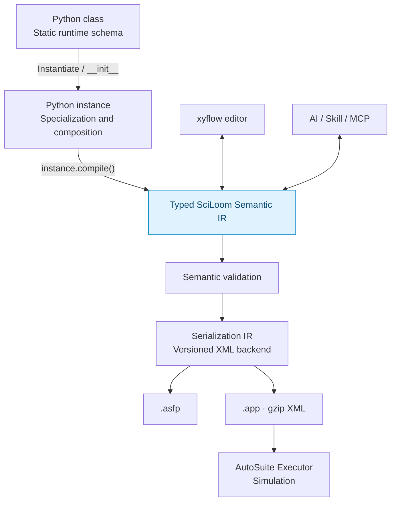

# Project state during the Semantic IR refactor

## Current compiler direction

Package reorganization and native declarations are implemented: authors use
`Input[float]`, `Output[bool]` and `Var[int] = 0` from `sciloom`, with AutoSuite
targets from `sciloom.contrib.autosuite`. JSON v3 list IR and reference execution
and Python list syntax are implemented, including AutoSuite array generation; see the
[active refactor contract](refactor/package-layout/00-overview.md).

The project has converged on a **model-first, instance-specialized compiler architecture**.
`sciloom.core.ir` provides immutable typed Function IR, validation and versioned JSON
interchange. The restricted Python `Function` frontend now lowers configured
instances with `.to_ir()` or emits ASFP through `.compile(target=...)`. The first Function
compiler sequence is implemented and structurally checked against retained fixtures.
See the [implementation sequence](refactor/semantic-ir/00-overview.md),
[IR API](11_SEMANTIC_IR.md), [Python frontend](12_PYTHON_FRONTEND.md) and
[ASFP compiler](13_ASFP_COMPILER.md). Executor simulation remains an external gate.

The [compiler foundation refactor](refactor/compiler-foundation/00-overview.md)
separates Python lowering, Program/JSON (now v3), reference execution and explicit target
compilation. Agitation provides a real high-level operation with logical resources
and typed speed; AutoSuite deployment bindings remain outside IR. See the
[implemented architecture](02_COMPILER_ARCHITECTURE.md).

The longer-term target architecture below includes deferred GUI/AI and APP paths:

The Python frontend reuses native Python syntax where AutoSuite semantics match (`if`, `while`, assignment, calls, expressions, constrained loops). Python AST/CST lowering is intentional.

**Staging rule:** Python is host/generation-time by default. Runtime fields are statically declared at class level. Only explicitly registered/decorated runtime methods and event roles are compiled as AutoSuite runtime code. `__init__` is ordinary Python and specializes the instance before compilation. A dedicated `@comptime` decorator is not part of the baseline design.

See `docs/04_PYTHON_FRONTEND_AND_STAGING.md` and `docs/05_INSTANCE_SPECIALIZATION_AND_COMPILE_API.md`.

## Error model decision

AutoSuite hardware/runtime faults are fatal by default. The proposed Python frontend may use lexical `try/except` for structured pre-stop fault actions, but fatal handlers preserve propagation using `raise`; they are not ordinary catch-and-continue blocks. Recoverable result-code/fallback errors are modeled separately.

See `docs/06_ERROR_HANDLING_MODEL.md`.

## External compiler work

All AutoSuite-specific reference material is organized under `autosuite/`, including
the original APP/ASFP archives, unique XML files, manual, matching function XML,
schema templates, recipe and inspection tools. See `autosuite/docs/00_REFERENCE_GUIDE.md`.

The historical compiler, ASPY examples/archive, text views, duplicate directory
aliases and obsolete cleanup reports have been removed. Generated XML candidates
are retained alongside FIXED/re-export evidence to explain schema differences;
they are not assumed to be accepted AutoSuite output.

## AutoSuite-side code

The newest supplied full app is richer than standalone function snapshots. It contains active/current versions of CSV table loading, Dynamic Transfer, 4NH/chunk logic, error helpers, valve logic, sample-ID labeling and GPC integration. When a standalone ASFP conflicts with this app, prefer the app version unless stronger AutoSuite re-export evidence says otherwise.

## Canonical source order

1. `autosuite/app/config20260909_polymerization.app`
2. functions extracted from that app
3. AutoSuite-produced FIXED/re-exported schema fixtures
4. `functionsPackage_0909.asfp` and matching standalone current snapshots
5. AutoSuite Manual 2.47.1.1 for documented semantics
6. historical generated XML candidates (comparison evidence only)

## Schema boundary

The supplied AutoSuite manual does **not** define the `.asfp/.app` XML schema/XSD. It documents semantics (Functions, Macro Tasks, variables, control flow, tasks, error hooks, etc.). XML serialization knowledge in this package is empirical and comes from exported/fixed `.asfp/.app` files.

## Deferred / excluded

- ArkSuite orchestration remains deferred until vendor documentation/API material is obtained.
- Deprecated COM integration is excluded from the architecture.
