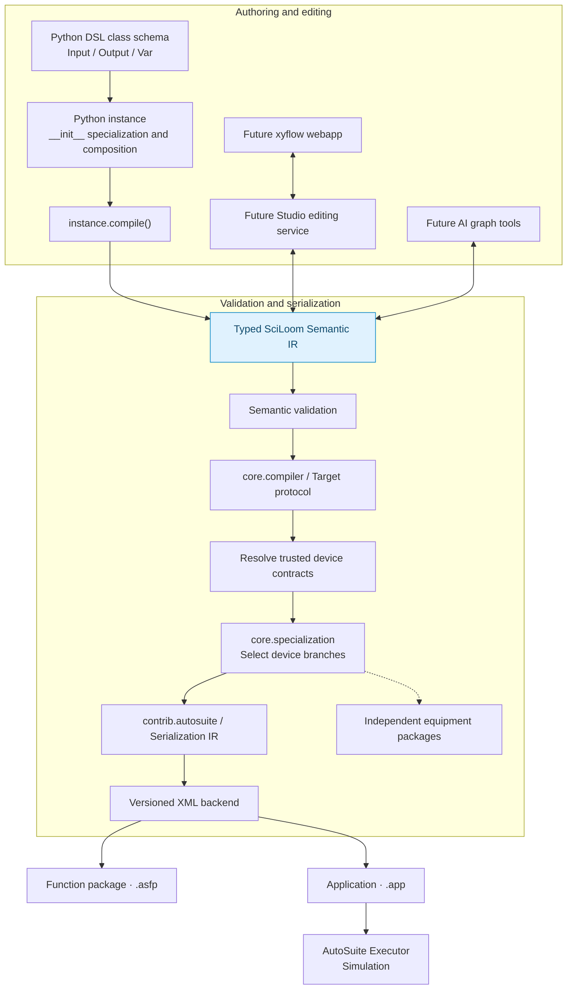

# Target architecture after ASPY refactor

Historical design context. The maintained description of implemented behavior is
the [architecture handbook](../website/docs/developer/architecture.md). Future API examples
below are retained as design history, not as currently supported interfaces.

**Status:** target design. See the [authoritative interface contract and staged
availability](refactor/package-layout/00-overview.md) and the
[current implementation](../website/docs/developer/architecture.md). Application/global, GUI
and additional hardware support remain future work.

## Core decision

The project moves from a language-first design to a **model-first, instance-specialized compiler architecture**.



## Class versus instance

The class defines the **static SciLoom runtime schema** and must be inspectable
before instantiation. This target declaration becomes available in stage 7;
AutoSuite list compilation follows in stage 8:

```python
from sciloom import Function, Input, Var


class ScaleValues(Function):
    values: Input[list[float]]
    index: Var[int] = 0
    batch_size: int = 8  # Host configuration.
```

The instance defines a **specialized program**:

```python
program = MyFunction(option=...)
artifact = program.compile(target=target)
```

`__init__` is ordinary Python and is the natural place for compile-time specialization, dependency/configuration binding and program composition. It should not be used to dynamically invent runtime field schema in v1.

Python is host-time by default; there is no required `@comptime` decorator.
`@runtime` marks the currently supported runtime method. Application event
decorators remain proposed rather than implemented.

## What is shared

Python, xyflow and AI are not separate compilers with separate semantic models. They are representations/editors of the same program model.

The Semantic IR owns:

- application/function/event-function structure;
- typed inputs, outputs, globals and local state;
- scopes and symbol relationships;
- expressions and units;
- runtime control flow;
- task/function calls and bindings;
- zones/wells/devices as semantic references;
- error/fault semantics;
- sequential/fragment execution semantics.

The GUI owns only view/layout metadata such as coordinates, collapse state and annotations.

## Serialization is a backend concern

AutoSuite-specific mechanics belong below the semantic layer:

- `typeid` values;
- UUID/object IDs;
- function parameter IDs and binding IDs;
- `<component>` versus `<task>` placement;
- `SATaskCondition/components` branch nesting;
- Macro Task default fields;
- AutoSuite version-specific XML fields;
- `.app` gzip packaging.

These should be produced by a thin Serialization IR + backend and should not shape the public frontend API.

## Why this is better than old ASPY

Historical ASPY was useful for reverse engineering because it made control flow and object relationships readable. It became problematic as a primary language because it duplicated Python syntax, required a custom parser, exposed serialization-driven constructs and forced users to hand-author a language they did not otherwise need.

The new design preserves the semantic discoveries while discarding the textual representation as a requirement.

## Initial backend scope

Do not try to synthesize an arbitrary machine configuration from zero in the first compiler milestone. Prefer:

1. import a known application/base/template for a known machine configuration;
2. manipulate/generate task/function/program sections through the semantic model;
3. serialize with corpus-derived adapters/templates;
4. validate statically;
5. validate on the IPC using Executor simulation.

## Explicitly deferred

- ArkSuite orchestration/monitoring until vendor documentation is available.
- Any deprecated COM-based integration path.
