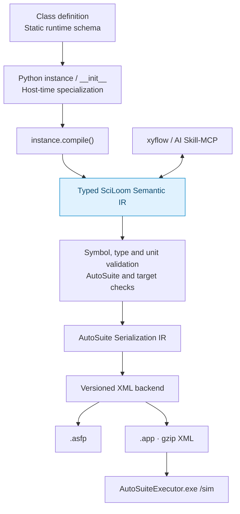

# Compiler architecture

## Architectural invariant

The compiler is **model-first**. Typed SciLoom Semantic IR is the central program representation shared across code, GUI and AI authoring paths.



## Why the Semantic IR must be explicit

The real corpus proves that AutoSuite contains distinctions a syntax-only AST must not blur:

- Function definition vs Macro Task scope;
- global vs Macro-local state and non-Python reset behavior;
- function parameter identity and call-binding IDs;
- direct function components vs tasks nested inside Macro Tasks;
- ordinary conditional Macro vs multi-condition IF/ELSE branch objects;
- repeat, while and sequential/fragment execution;
- sequential fragment variable vs normal loop variable;
- device-specific Execute Operation payloads;
- zones, wells, elements and device references;
- application event functions such as OnStart/OnError/OnStop;
- recoverable result-style errors vs fatal AutoSuite faults.

These are semantic nodes/relationships, not serialization details.

## Python frontend and compilation unit

The new Python DSL is a **restricted source language**, not merely an executed builder API. Runtime method bodies are parsed through Python AST/CST and lowered into Semantic IR. Native Python syntax is reused where target semantics are equivalent.

The compilation unit is an **instance**, not the class object:

```python
program = DynamicTransfer(valve_group_size=8)
artifact = program.compile(target=isynth)
```

The class provides statically inspectable runtime schema. `__init__` and ordinary helper code execute as normal Python and specialize the instance before compilation. No dedicated `@comptime` stage marker is required in the baseline design.

A runtime `self.attr` is resolved in two layers:

1. if `attr` is a registered class-level AutoSuite field, lower it as a target runtime symbol;
2. otherwise resolve the specialized Python instance value as host-time data/component, subject to supported constant/object lowering rules.

This gives a clean staging boundary without redefining ordinary Python execution.

See `docs/04_PYTHON_FRONTEND_AND_STAGING.md` and `docs/05_INSTANCE_SPECIALIZATION_AND_COMPILE_API.md`.

## GUI and AI stage

xyflow edits a graph projection of the same Semantic IR. AI either edits that graph through Skill/MCP tooling or emits the same restricted Python frontend. No separate GUI language or AI pseudo-language should exist.

See `docs/07_XYFLOW_AI_SHARED_IR.md`.

## Serialization backend

AutoSuite XML mechanics belong below the semantic layer:

- UUID/object IDs;
- function parameter IDs;
- `typeid` strings;
- XML field ordering/defaults;
- exact branch/container nesting;
- target-version differences;
- application gzip packaging.

For device-specific tasks, prefer corpus-derived XML templates plus typed adapters over inventing fields from general documentation.

## Compiler pipeline

1. Inspect the AutoSuite model class and registered runtime-field schema.
2. Instantiate normally in Python; run `__init__` and host-time composition/specialization.
3. Call `instance.compile(...)`.
4. Discover registered runtime/event methods on the class.
5. Parse/retrieve those method bodies as Python AST/CST.
6. Resolve `self` references against class runtime fields vs specialized instance attributes.
7. Resolve symbols, function/component relationships and compile-time constants.
8. Infer/check AutoSuite types and physical units.
9. Lower supported Python control flow into typed SciLoom runtime semantics.
10. Validate AutoSuite rules (scope, recursion, sequential constraints, task requirements, error semantics).
11. Resolve known configuration/zone/device references.
12. Lower Semantic IR → Serialization IR.
13. Allocate target IDs and references.
14. Serialize `.asfp` or `.app` XML; gzip `.app` as required.
15. Run structural/schema-corpus checks.
16. Run `AutoSuiteExecutor.exe generated.app /r /sim 100 /s /c` on the AutoSuite host.

`.compile()` should preferably be semantically pure with respect to the source instance: it may cache derived compilation data, but it should not silently rewrite the user's declared/specialized program state.

## First implementation boundary

Do not begin by generating arbitrary hardware configurations from scratch. First target a known machine configuration/base application and manipulate or generate the application/function sections needed by the current system. This reduces risk while the serialization backend is still empirical.
