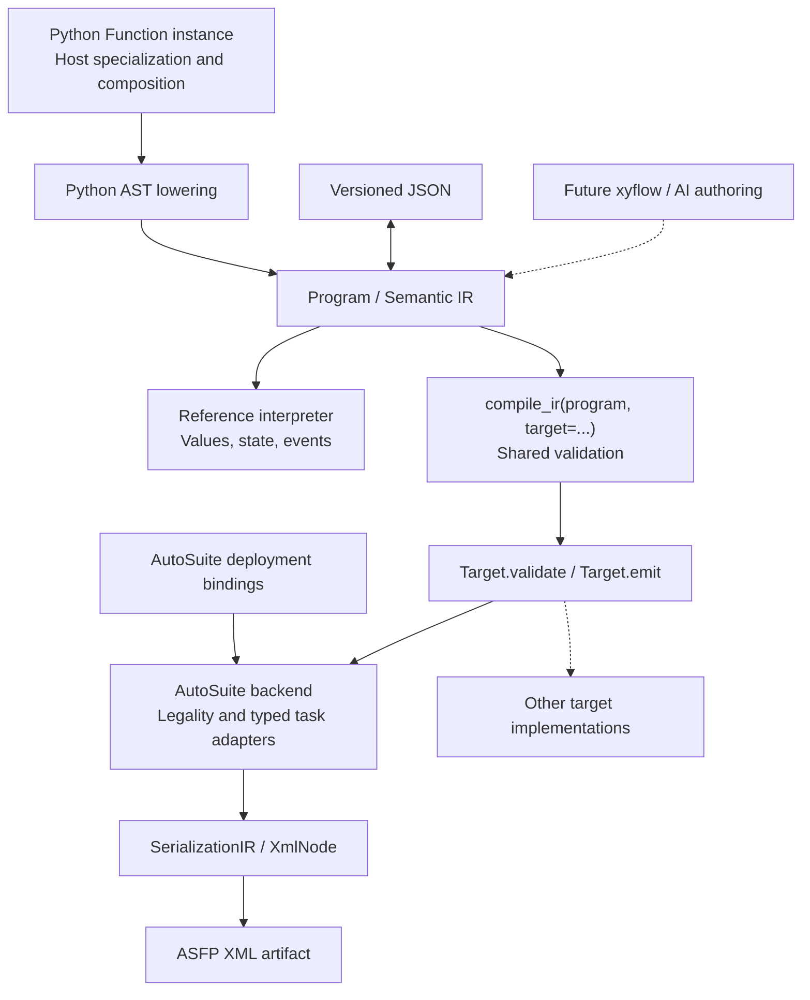

# Compiler architecture

SciLoom has one typed semantic program model, multiple authoring paths and explicit
compilation targets. The Python frontend interprets source syntax; the IR retains
program intent; a backend chooses how to express that intent on its platform.

## Implemented boundaries



The interpreter and a test-only non-XML target independently exercise this
boundary. Neither generic compilation nor IR execution imports AutoSuite.
GUI/AI authoring, additional production targets and Application generation remain
future work; ASFP and reference execution are implemented now.

| Module | Owns |
|---|---|
| `frontends/python/model.py` | Function class schema, decorators and public source API |
| `frontends/python/lowering.py` | File-backed source discovery, AST resolution and lowering to Program |
| `ir/model.py` | Immutable typed program, variables, expressions, structured control flow and domain operations |
| `ir/schema.py`, `validation.py`, `codec.py` | Structure, semantic legality and JSON v2 interchange |
| `units.py` | Shared rotational-speed values and rpm/rps conversion |
| `interpreter/runtime.py` | Reference evaluation, call frames, persistent state, budgets and domain events |
| `compiler.py` | Target protocol, shared compilation pipeline and generic byte artifacts |
| `backends/autosuite/target.py` | Vendor version/configuration and target restrictions |
| `backends/autosuite/codegen.py` | Function/control-flow mapping, target names and IDs |
| `backends/autosuite/agitation.py` | Individual-shaker binding and typed Stir adapter |
| `backends/autosuite/xml.py` | Immutable serialization records and XML encoding |
| `diagnostics.py` | Shared errors, diagnostics and source locations |

## Source lowering, semantics and compilation

```python
function = MyFunction(option=...)
program = function.to_ir()
result = compile_ir(program, target=target)
# Convenience: function.compile(target=target)
```

Class declarations define runtime fields; ordinary Python construction supplies
host values and composed components. Lowering resolves registered runtime fields
to typed symbol references and supported host values to constants/components.
It parses runtime methods from ordinary .py files and never runs their bodies.

Program selects an entry function and owns specialized FunctionIR records and
logical resources. Function variables have explicit owner and role. Internal
defaults initialize session state; they are not implicit assignments on every
call. Calls retain parameter bindings; If and While retain structured regions.
A JSON or future GUI frontend can create these same records without Python.

This IR resembles a compiler IR in its role as a stable semantic boundary. It is
a structured scientific-program model, not LLVM instructions or SSA. No optimizer,
pass registry or generic opaque-operation framework is introduced here.

Generic compilation first validates the IR, then asks the explicit target to
validate and emit it. A target returns an Artifact containing bytes, media type
and suffix. Unsupported target semantics fail with diagnostics. Recursion and
short-circuit operators are currently rejected by AutoSuite; they remain valid
in the reference semantics. Target limitations must not narrow the shared model.

`compiler.py` contains both an interface (`Target`) and a concrete shared pipeline
(`compile_ir`), plus `Artifact` and `CompileResult`. AutoSuiteTarget implements
the Target protocol structurally: it provides `target_id`, `validate(program)`
and `emit(program)` without needing to inherit a compiler class. Its emission
uses `codegen.py` to map Program into SerializationIR and `xml.py` to encode XML.
Another backend implements the same protocol with its own validation and output
format; the shared pipeline does not change or acquire vendor-specific imports.

Python `lowering.py` consumes source and produces semantic IR. AutoSuite
`codegen.py` consumes that IR and produces a target-specific structure; it never
parses Python. Its helper is called `lower_asfp` because this internal step lowers
semantics into serialization records, before the final XML encoding.

## Preserve high-level intent until target lowering

AgitatorResource, SetAgitation and StopAgitation remain visible in Program. A
set-speed operation carries a typed rotational-speed expression; stopping has
no speed argument. Neither Python lowering nor IR validation replaces these
operations with device IDs, XML fields or anonymous calls.

The reference interpreter can observe and execute that intent without a backend.
AutoSuite binds a logical resource to a concrete zone/individual shaker, then
serializes the observed Stir payload. Rebinding changes the deployment artifact
without changing Program. This validates the architectural boundary with one
real operation; it does not establish a universal abstraction for all mixing
mechanisms or automatic portability to every laboratory platform.

The same distinction applies to scalar/control-flow serialization: Macro wrappers,
branch container names, UUIDs, parameter IDs, typeid suffixes and field order are
backend choices. Scope, value ownership, branch selection and call relationships
are semantic concerns. A vendor's container structure must not dictate the IR.

## Evidence and verification

Four FIXED exports test existing assignment/call/control-flow structures. The
latest APP's Sample and Run GPC and a concrete-zone export test agitation.
Generated output lives outside the original evidence corpus. JSON round trips,
direct IR authoring, a non-XML target and independent reference execution ensure
that matching vendor XML is not the only acceptance criterion.

See [reference execution](14_REFERENCE_EXECUTION.md),
[agitation semantics](15_AGITATION_SEMANTICS.md), and
[AutoSuite mapping evidence](../autosuite/docs/16_AGITATION_MAPPING.md).
Static checks do not prove Executor acceptance or physical behavior. Application
generation, globals, events, recovery, device discovery and full unit algebra
remain outside the current implementation.
