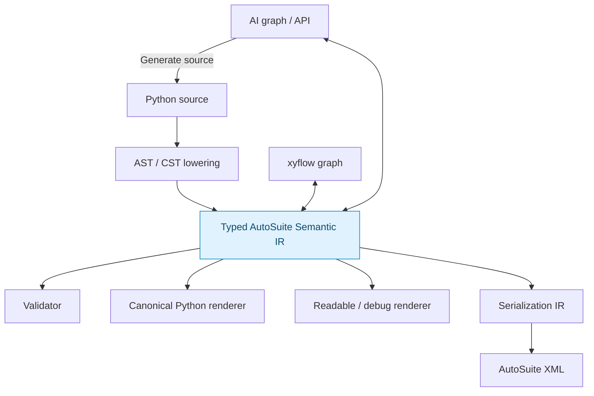

# Representation-layer redesign

## Decision

The historical ASPY textual syntax is retired as the primary user-facing representation.

Its main value was discovering AutoSuite's semantic ontology: typed state, Functions, Macro scopes, function bindings, IF/ELSE/WHILE, sequential fragments, tasks, event hooks, zones and serialization relationships. Those discoveries are preserved in the Semantic IR and schema corpus.

## New representation strategy



The old ASPY-like textual view can still be useful for XML reverse rendering, diffs and LLM context, but it is not the contract users must hand-author.

## Pydantic / SQLAlchemy analogy

The proposed Python layer should feel like a typed model/schema system:

- Pydantic-like declarations for Inputs/Outputs/Locals/Globals and units;
- SQLAlchemy-like object relationships for function, parameter, zone, well and device references;
- native Python syntax for runtime control flow where semantic equivalence exists;
- explicit decorators/roles only for staging and AutoSuite-specific lifecycle concepts.

## No frontend should own target IDs

User code and GUI nodes should refer to semantic objects. Target UUIDs, function parameter IDs and task `typeid`s are assigned/resolved only in the serialization layer.

## Runtime control flow

Unlike the previous builder sketch, the current proposal deliberately compiles a restricted Python subset. Therefore ordinary Python source such as:

```python
while self.index < len(self.volumes):
    if self.volumes[self.index] > 0 * mL:
        transfer(...)
```

is parsed and lowered into AutoSuite runtime semantic nodes. The method body is not executed as normal Python.

## Error handling

Fatal AutoSuite faults and recoverable result-style errors are separate Semantic IR concepts. A Python `try/except` form may be supported as structured fatal pre-stop handling, with `raise` preserving fatal propagation. See `docs/06_ERROR_HANDLING_MODEL.md`.

## GUI projection

GUI layout/state is not semantic state. Keep coordinates, viewport, grouping and collapse state in a separate view model keyed by stable semantic node IDs.

## Canonical source rendering

For a first version, prefer deterministic IR → canonical Python regeneration over exact round-trip preservation of arbitrary human formatting/comments. Exact CST-preserving round trip can be considered later if it proves necessary.
