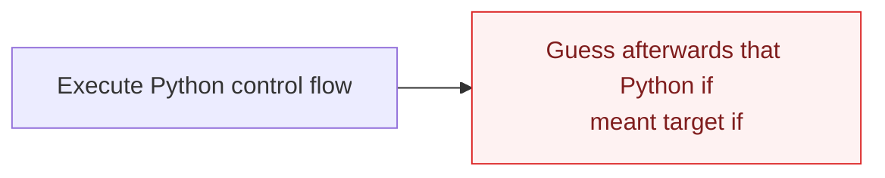
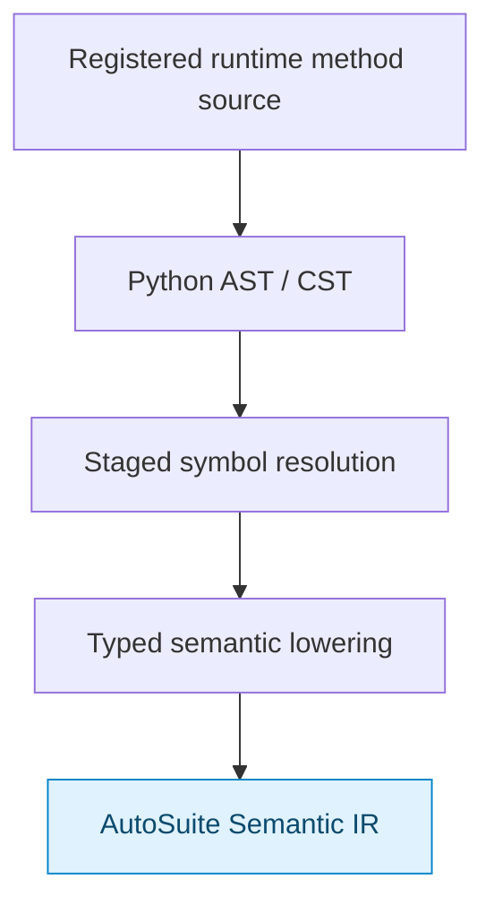
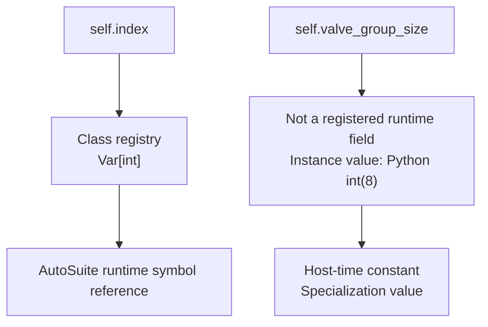

# Restricted Python frontend and staging model

Historical design context. Use the maintained [declarations reference](../website/docs/user-guide/reference/declarations.md)
and [runtime language](../website/docs/user-guide/reference/runtime-language.md) for implemented behavior. The
broader device/event/error examples below remain proposals and are not runnable.

## Design goal

A class such as `DynamicTransfer(Function)` defines the static schema of an AutoSuite program unit. An **instance** of that class is the concrete, compile-time-specialized program that is compiled.

Users should write ordinary Python-looking declarations and control flow rather than custom pseudo-code keywords.

```python
class DynamicTransfer(Function):
    source: Input[Zone]
    destination: Input[Zone]
    volumes: Input[Array[Volume]]
    index: Var[int] = 0

    def __init__(self, *, valve_group_size: int = 8):
        # ordinary Python / host-time specialization
        self.valve_group_size = valve_group_size

    @sciloom.runtime
    def run(self):
        while self.index < len(self.volumes):
            volume = self.volumes[self.index]

            if volume > 0 * mL:
                self.transfer_one(volume, group_size=self.valve_group_size)

            self.index += 1

program = DynamicTransfer(valve_group_size=8)
artifact = program.compile(target=isynth)
```

The frontend compiler lowers Python AST/CST nodes from registered runtime methods into Typed SciLoom Semantic IR. It does **not** execute runtime methods as ordinary Python.

## Why Python AST analysis is appropriate here

There are two very different architectures.

### Fragile builder inference



That is not the design.

### Restricted source compiler



This is the intended architecture. AST/CST analysis is a first-class compiler step.

## Staging: Python host-time versus AutoSuite runtime

The default rule is deliberately simple:

> **Python is Python unless explicitly registered as AutoSuite runtime code/state.**

### Host/generation-time Python

Normal Python execution includes:

- module execution;
- class construction/metaclass registration;
- `__init__`;
- ordinary helper methods invoked during construction;
- configuration inspection;
- dependency/program composition;
- template specialization;
- constant calculation and data preparation.

No `@comptime` decorator is required in the baseline architecture.

### AutoSuite runtime

AutoSuite runtime consists of:

- class-level registered runtime fields (`Input[T]`, `Output[T]`, `Var[T]`, and future `GlobalRef[T]` dependencies);
- registered runtime methods / event entry points;
- task execution;
- runtime expressions;
- hardware calls;
- `if`/`while`/supported runtime loops;
- runtime fault handling.

Decorators should mark **entry into AutoSuite runtime semantics**, not host-time code.

Illustrative names:

```python
@sciloom.runtime
@sciloom.main
@sciloom.on_start
@sciloom.on_error
@sciloom.on_stop
```

## Class schema is static

Runtime fields should be class-level declarations so they are available before instantiation:

```python
class LoadReagent(Function):
    source: Input[Zone]
    reactor: Input[Zone]
    volumes: Input[Array[Volume]]
    status: Output[int]
    idx: Var[int] = 0
```

A metaclass/`__init_subclass__`/descriptor registry can collect them into a Pydantic-like schema.

This enables, before instantiation:

- IDE/static inspection;
- GUI node palette/schema generation;
- AI/MCP schemas;
- documentation;
- inheritance validation;
- function-call binding checks.

First-version rule: do **not** allow `__init__` to silently create new runtime schema.
`__init__` configures a concrete instance; it does not redefine the model type.

Class-level `Var[T]` fields (`index: Var[int] = 0`) declare internal runtime
state on Function and, in the future, global state on Application. Unwrapped
annotations (`group_size: int = 8`) remain host-time data. Use native Python
types within Input/Output/Var; there is no `Local[T]` wrapper.
Declaration defaults do not imply resetting a Macro variable on each call; reset
explicitly with a runtime assignment when required.

The first frontend reads ordinary `.py` modules and reports unavailable runtime
source explicitly. Notebook, interactive and `exec()` definitions are deferred.

For future shared state, a Function declares `flag: GlobalRef[bool]`, then binds
that dependency using `function.bind_globals(flag=app.ref("flag"))`. Application
owns the declaration; the function references the same variable. Python module
globals are never implicitly promoted to AutoSuite globals.

## Instance specialization

The instance supplies host-time values that can affect the generated target program:

```python
program8 = DynamicTransfer(valve_group_size=8)
program16 = DynamicTransfer(valve_group_size=16)

artifact8 = program8.compile(target=isynth)
artifact16 = program16.compile(target=isynth)
```

Both instances share the same runtime schema but may compile to different AutoSuite structures/constants.

`__init__` is also a natural place for composition:

```python
class Polymerization(Application):
    def __init__(self, reactor, *, enable_analysis=True):
        self.load = LoadReagent(reactor=reactor)
        self.react = ReactionStep(reactor=reactor)
        self.analysis = GPCDispatch(...) if enable_analysis else None
```

The `enable_analysis` branch is ordinary Python and is resolved before AutoSuite runtime code is generated.

## Resolving `self.attr` inside runtime code

At compile time, the frontend should classify attributes using the class schema and specialized instance:



This distinction is one of the main benefits of class-schema + instance-compilation.

## `.compile()` API

Compilation belongs to the instance, typically inherited from a common base:

```python
artifact = program.compile(target=isynth)
artifact.write("program.asfp")
```

An `Application` instance can produce `.app`, while a `Function` instance can produce `.asfp` (exact API remains implementation detail).

`.compile()` should preferably not mutate the user's semantic/source instance. It can return a `CompileResult` containing Semantic IR, validation diagnostics, Serialization IR and final artifacts.

## Supported Python subset

The compiler should explicitly specify a subset rather than promise Python compatibility. Strong first candidates are:

- annotated runtime-state declarations;
- assignment and augmented assignment;
- arithmetic/boolean comparisons;
- `if/elif/else`;
- `while`;
- constrained `for` forms with defined AutoSuite mappings;
- function/task calls;
- `return`;
- arrays/indexing;
- typed physical quantities;
- zone/well/property operations;
- supported `try/except ... raise` fault-region syntax.

Unsupported constructs should fail during compilation rather than silently change meaning.

## `for` should be type-directed

Surface syntax can remain Pythonic while the iterable type determines target semantics.

```python
for i in sciloom.range(n):
    ...
```

may map to a repeat loop, while:

```python
for well in reactor_zone.scan(by=1):
    ...
```

may map to AutoSuite sequential/fragment semantics.

The Semantic IR must preserve the distinction even if the surface syntax is both `for`.

## Source of truth and round-trip

The semantic graph is the cross-frontend source of truth. A `.py` file can still be the human-authored source for a code-centric workflow, but the GUI must not depend on preserving arbitrary Python formatting.

Preferred first implementation:

- Python class/instance → IR is deterministic.
- GUI edits IR directly.
- IR can regenerate **canonical Python** for review/export.
- Exact source-format/comment round-trip is not a v1 requirement.
