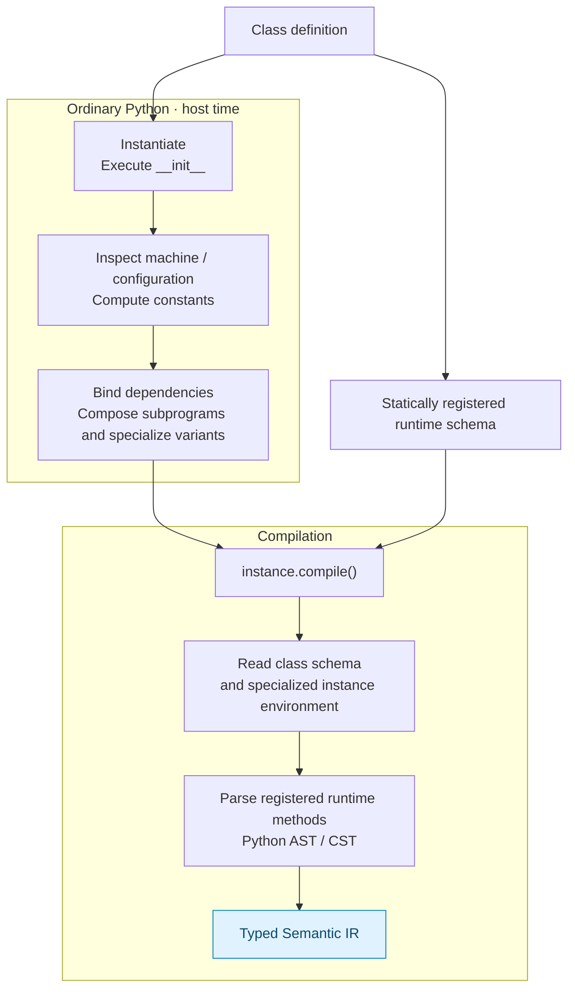
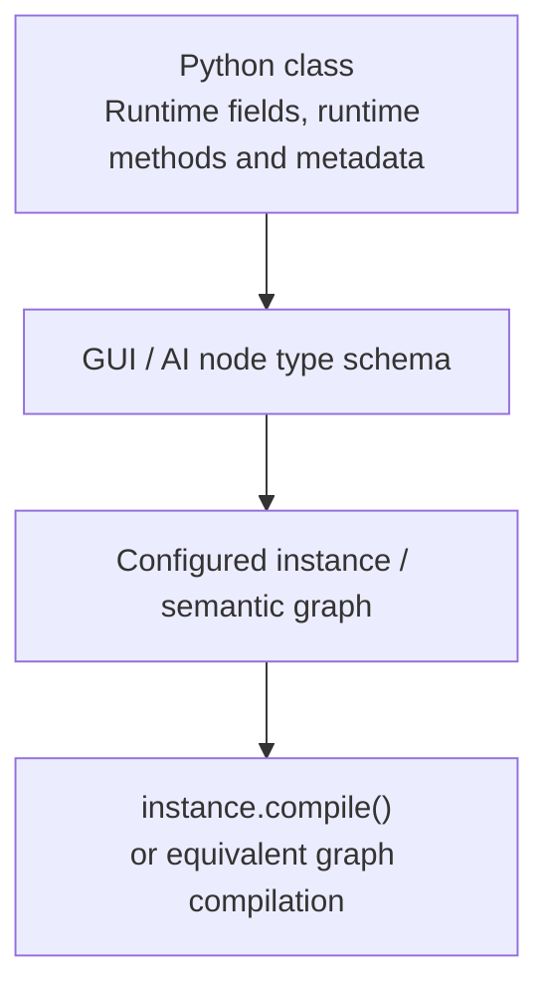

# Instance specialization and compile API

**Status:** accepted pre-refactor architecture decision, 2026-09-10.

## Decision

AutoSuite program classes define reusable **runtime schema/types**. Concrete instances define **host-time-specialized programs**. Compilation therefore occurs on an instance:

```python
program = DynamicTransfer(
    valve_group_size=8,
    preferred_channels=(1, 2, 3, 4),
)

artifact = program.compile(target=isynth)
```

A top-level `autosuite.compile(program)` may exist internally or as convenience, but it is not the preferred public model. `.compile()` should be a built-in method inherited by AutoSuite program objects.

## Why instance-first compilation

It makes normal Python object construction the metaprogramming/generation layer:



This removes the need for a general `@comptime` decorator. Host-time code is simply ordinary Python.

## Static runtime field schema

Runtime state must remain visible on the class before an instance exists:

```python
class DynamicTransfer(Function):
    source: Input[Zone]
    destination: Input[Zone]
    volumes: Input[Array[Volume]]

    index: Local[Integer] = 0
    error_code: Output[Integer] = 0
```

The framework should collect these definitions at class creation, similar to `Pydantic.model_fields` or SQLAlchemy declarative mappings.

Possible implementation mechanisms include descriptors + metaclass, `__init_subclass__`, or an equivalent registration pass. The exact implementation is deferred.

## Why runtime fields should not be created in `__init__`

This pattern should not be supported initially:

```python
def __init__(self):
    self.index = Local[Integer](0)  # discouraged / compile error in v1
```

If runtime state only appears after instantiation, the framework loses important static properties:

- GUI node schemas cannot be generated from the class alone;
- AI/MCP input/output contracts are less stable;
- IDE/static inspection is weaker;
- function signatures and bindings become instance-dependent;
- inheritance/schema compatibility becomes harder to validate;
- compiler symbol resolution is less deterministic.

Therefore:

> **Class = AutoSuite runtime schema. Instance = specialized realization of that schema.**

## `__init__` responsibilities

`__init__` may freely create ordinary Python compile-time attributes and subcomponents:

```python
class DynamicTransfer(Function):
    index: Local[Integer] = 0

    def __init__(self, *, valve_group_size=8, channels=(1, 2, 3, 4)):
        self.valve_group_size = int(valve_group_size)
        self.channels = tuple(channels)
        self.channel_plan = build_channel_plan(self.channels)
```

Those values can influence lowering:

```python
@runtime
def run(self):
    group_end = valve_group_end(
        self.index,
        group_size=self.valve_group_size,
    )
```

Here `self.index` is an AutoSuite runtime symbol, while `self.valve_group_size` is a specialized host-time constant.

## Attribute-resolution rule

When lowering a registered runtime method, resolve `self.attr` in this order:

1. **Registered runtime field on class** → AutoSuite symbol/reference.
2. **Registered subprogram/component relationship** → semantic program relationship.
3. **Ordinary instance attribute** → host-time specialization value, if supported/serializable/constant-foldable.
4. Otherwise → compile diagnostic.

This needs strong diagnostics to prevent accidental mixing of Python objects into runtime expressions.

## Program composition

Instance construction naturally supports conditional composition:

```python
class Polymerization(Application):
    def __init__(self, reactor, *, enable_gpc=True):
        self.load = LoadReagent(reactor=reactor)
        self.react = ReactionStep(reactor=reactor)
        self.gpc = GPCDispatch(...) if enable_gpc else None
```

The branch is resolved by Python before target runtime. The compiled graph already contains or omits the GPC component.

This favors a general design principle:

> Use inheritance primarily for reusable model/schema behavior; use composition heavily for constructing concrete AutoSuite programs.

The precise Function/Macro/Application composition API remains a formal-refactor question.

## `.compile()` result

A useful conceptual result type is:

```python
result = program.compile(target=isynth)

result.diagnostics
result.semantic_ir
result.serialization_ir
result.artifact
result.write("polymerization.app")
```

For a `Function`, the default artifact may be `.asfp`; for `Application`, `.app`. Exact naming/API is not frozen.

Compilation should preferably be source-instance preserving: no hidden mutation of declared runtime state or host-time configuration should be necessary to obtain an artifact.

## Interaction with xyflow and AI

The class schema can produce a node-type contract before instantiation. A specific instance maps to a configured node/subgraph and then to Semantic IR.



The graph/IR remains the shared semantic substrate. The instance-first Python API is the code-centric frontend, not a competing model.
