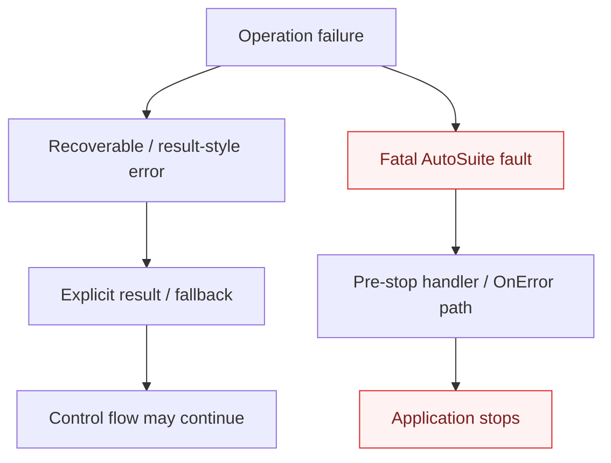
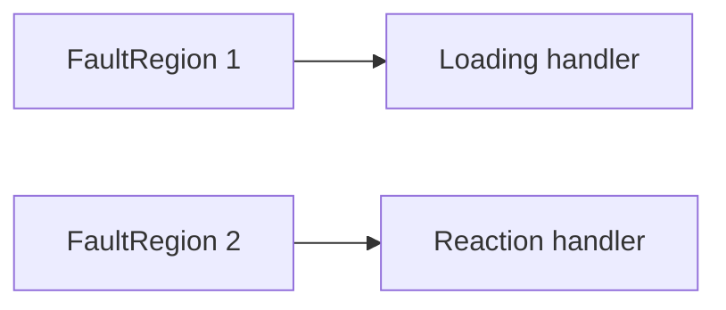

# Error handling model for the new frontend

## AutoSuite primitives confirmed by the supplied manual

The supplied AutoSuite 2.47.1.1 manual documents an application-level **Error Function / OnError**. It runs before the error is shown and the application is stopped. Only one Error Function can be defined per application. Within it, `ErrorMessage` contains the original error text. The manual recommends keeping this function simple and warns against unsafe/time-consuming recovery actions. If another error occurs inside the Error Function, the application stops directly. The Error Function is not executed when the application is paused/unlocked; the error is shown and the application stops.

The Stop Function is not a general error-finally hook: when the application fails with an error, the documented Stop Function is not used as the error handler.

The Configuration Manager also has an **Exception Handling** setting that can start an external executable when an error occurs, passing the error in command-line text. The manual gives email notification as an example. This external executable is not triggered in simulation mode.

Separately, some tasks/functions expose explicit result/error-code modes that allow the application to continue under program control, e.g. Import CSV result codes, Database Operation Result and file operations with non-stopping behavior.

## Semantic split

The compiler should therefore model two categories:



Hardware faults should default to the fatal category unless a documented target primitive says otherwise.

## Proposed Python surface

Native `try/except` is useful as a **structured pre-stop fault-handler syntax**, but it must not imply ordinary Python catch-and-continue semantics for fatal AutoSuite faults.

Preferred form:

```python
try:
    critical_operation()
except AutoSuiteError as err:
    log(err)
    alert_maintenance(err)
    raise
```

`raise` makes the intended semantics explicit: perform structured fault actions, then preserve fatal propagation.

Default hardware calls do not need a redundant `try/except` wrapper. Use `try/except` only when a scope needs additional failure actions.

## Possible lowering with one AutoSuite OnError

AutoSuite exposes one application-level Error Function, while the Python frontend may allow lexical fault regions. The backend can lower multiple lexical regions into a generated fault-scope state.

Conceptually:

```python
# source
try:
    load_reagent()
except AutoSuiteError as err:
    log_loading_fault(err)
    raise

try:
    start_reaction()
except AutoSuiteError as err:
    alert_maintenance(err)
    raise
```

can lower to semantic fault regions:



and then to target bookkeeping such as:

```text
__fault_scope = 1
load_reagent()
__fault_scope = 0

__fault_scope = 2
start_reaction()
__fault_scope = 0
```

plus one generated OnError that dispatches by `__fault_scope` before the normal AutoSuite stop behavior completes.

This is a proposed compiler technique, not a vendor-defined schema feature. It must be verified against actual AutoSuite error propagation and nested call behavior before implementation.

## `pass` versus `raise`

Do not redefine Python `except: pass` to mean fatal propagation. Python users naturally read `pass` as swallowing the exception. Prefer `raise` for fatal handlers.

A future compiler may allow an implicit re-raise at the end of fatal AutoSuite handlers, but explicit `raise` is safer and clearer in the initial design.

## Recoverable errors

When AutoSuite itself provides result-code/fallback semantics, the frontend may support ordinary branching or, later, a genuinely recoverable exception form. The Semantic IR must distinguish this from fatal faults before XML lowering.

## Future extensions

Safe pre-stop actions may include, where supported and validated:

- structured logging;
- external maintenance notification;
- alert lamp/status update;
- invoking safe non-robotic shutdown helpers;
- signaling another orchestration node/system;
- external executable notification through documented AutoSuite exception handling.

Do not assume arbitrary robotic motion is safe from an error handler.
