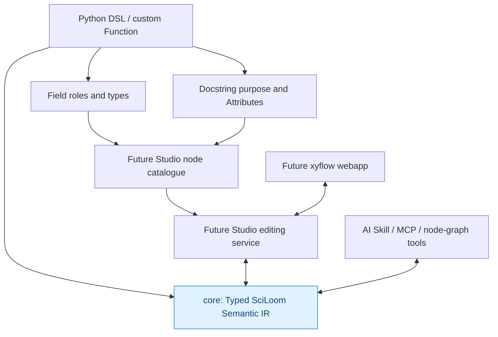
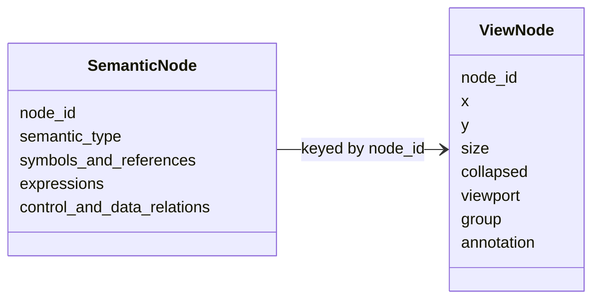

# xyflow, Python and AI on one semantic model

**Status:** future tooling design. This sequence defines the boundaries and
docstring convention; it does not implement Studio, a server or a webapp. Exact
package/API decisions are in the [interface contract](refactor/package-layout/00-overview.md).

## One model, multiple representations

The agreed design is that all authoring paths converge on the same Typed SciLoom Semantic IR.

There is no separate “GUI AST” or “AI pseudo-language”.

Users define reusable nodes as ordinary SciLoom Function classes. Field schema
provides ports and types; the class docstring describes purpose and an Attributes
section describes fields by their actual names. Constructor Args describe host
configuration. Types need not be repeated in prose. Descriptions assist users and
AI but never determine execution semantics. Description extraction and node
registration are future work.

GUI composition edits the IR through Studio directly, without routing every edit
through regenerated Python. New primitive semantics still require contributor
implementation; composing existing Functions does not.

## xyflow responsibilities

The GUI should project Semantic IR nodes into a flow representation suitable for visual programming and preview. It may expose:

- control-flow edges;
- data/binding edges;
- task/function nodes;
- variable/state nodes;
- typed ports;
- zone/device references;
- nested scopes/containers;
- validation diagnostics.

GUI-specific state is separate:

Moving a box must not create a semantic program change.

## AI responsibilities

AI can interact through either of two equivalent paths:

1. edit/query Semantic IR or its graph projection through Skill/MCP tooling;
2. generate the restricted Python DSL and invoke the same compiler.

The validator is authoritative regardless of how the program was created.

## Python regeneration

A deterministic IR → canonical-Python renderer is useful for:

- code review;
- diffs;
- handoff from GUI user to programmer;
- AI context;
- exporting a visual workflow as maintainable code.

Exact preservation of arbitrary original Python formatting is not required for the initial architecture.

## Why this matters

A scientist can construct the same program visually that an engineer writes in Python and that an AI edits through a graph interface. All three paths receive the same type checking, target validation and XML backend behavior.
