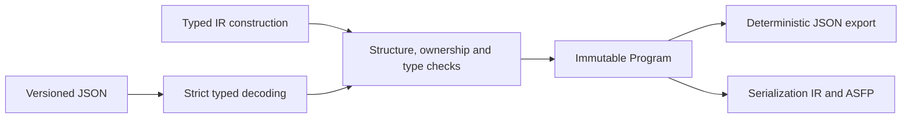

# Semantic IR and JSON API

`sciloom.core.ir` implements the first stage of the compiler. It can represent and
validate functions directly or through JSON. The [Python Function frontend](12_PYTHON_FRONTEND.md)
also lowers into this model. The [ASFP compiler](13_ASFP_COMPILER.md) consumes it
through `instance.compile(target=...)` or `compile_ir(package, target=...)`.

## Architecture



`core/ir/types.py` defines value types and assignment compatibility;
`core/ir/model.py` defines immutable semantic nodes. `core/ir/expressions.py`
checks expression types and symbol ownership, while `core/ir/validation.py`
checks the whole program. `core/ir/schema.py` checks structure independently of
the JSON boundary in `core/ir/codec.py`. `core/diagnostics.py` provides errors.
There are no runtime dependencies outside Python's standard library.

`device_contracts.py` defines versioned, data-only type/property/command signatures.
`device_validation.py` validates their directory and ancestry. DeviceResource
refers to a declared type; ConfigureProperty captures a value, while
StartAgitation/StopAgitation preserve lifecycle intent. DeviceCommand, DeviceIf,
CanWrite, SupportsOperation and IsDevice are part of v4 interchange. Native commands
compile via trusted contributor signatures; the interpreter rejects commands with
no reference execution semantics. `core.specialization.specialize(program,
bindings=...)` selects device branches purely from trusted data, preserves source
identity and returns a validated high-level program with bound resource types.

## Typed construction

The following is a runnable IR example for frontend/backend developers. The
scientist-facing Python DSL will use ordinary assignment and control flow instead
of these constructors.

```python
from sciloom.core.ir import (
    Assignment, FunctionIR, Program, Reference, ScalarType,
    Variable, VariableRole, from_json, to_json, validate,
)

identity = FunctionIR(
    node_id="fn:identity",
    name="Identity",
    variables=(
        Variable(node_id="var:x", owner_id="fn:identity", name="x",
                 role=VariableRole.INPUT, type=ScalarType.REAL),
        Variable(node_id="var:y", owner_id="fn:identity", name="y",
                 role=VariableRole.OUTPUT, type=ScalarType.REAL),
    ),
    body=(Assignment(
        node_id="stmt:copy",
        target=Reference(node_id="ref:y", symbol_id="var:y"),
        value=Reference(node_id="ref:x", symbol_id="var:x"),
    ),),
)
package = Program(entry_function_id=identity.node_id, functions=(identity,))
assert validate(package) == ()
assert from_json(to_json(package)) == package
```

`validate()` returns a tuple of `Diagnostic` records. Import/export raises
`IRValidationError` with `.diagnostics` on invalid input. Each diagnostic contains
`code`, `message` and a JSON-style `path`, plus `node_id` and `source` when available.
`SourceSpan` uses a one-based line and zero-based UTF-8 byte column, matching Python AST.

## Semantic contract

- A `Program` selects an entry function and contains all referenced functions.
  Calls reference `FunctionIR.node_id`; input/output bindings reference the callee's
  variable IDs, not names or positional indexes. Every parameter is bound once.
- Each variable has an explicit `owner_id` matching its containing function, a
  role (`input`, `output`, `internal`) and a value type: scalar (`integer`, `real`,
  `boolean`, `rotational_speed`) or `ListType(element_type=...)`.
  Names are unique within a function. References cannot cross function ownership.
- Internal variables require a literal initial value. This represents target
  initialization, not an implicit assignment at function entry. Parameter default
  values are outside v4. List initializers contain only scalar Literal elements.
  Assignment and output-call destinations use variable references; ListSet handles
  indexed writes explicitly.
- Expressions include typed literals, references, unary `+`/`-`/`not`, arithmetic
  `+`/`-`/`*`/`/`, comparisons and boolean `and`/`or`. Boolean is distinct from integer;
  integer-to-real widening is allowed, narrowing is not. Division produces real.
  Conditions must be boolean. No Python truthiness is inferred.
- Statements include assignment, calls, `If` with ordered then/else bodies and
  `While`, plus typed ConfigureProperty/StartAgitation/StopAgitation device operations. An `elif` can be represented as an `If` inside the else body. Recursive
  call graphs are representable; AutoSuite target validation rejects them.
- IDs identify occurrences. Even two reads of the same variable have distinct
  node IDs and the same `symbol_id`. Variable, function, statement and expression
  IDs share a package-wide namespace. The caller supplies IDs; import never invents them.
- Global ownership and binding remain a future extension. V4 rejects foreign
  variable references, unknown roles and unsupported kinds instead of guessing.

## JSON contract

The following direct-device example is runnable from the v4 lifecycle stage:

```python
from sciloom.core.ir import (
    ConfigureProperty, DeviceResource, FunctionIR, Literal, Program,
    ScalarType, StartAgitation,
)
from sciloom.core.ir.device_contracts import (
    AGITATOR_CONTRACT, AGITATOR_TYPE_ID, AGITATION_SPEED_ID, BASE_DEVICE_CONTRACT,
)
from sciloom.core.interpreter import Interpreter
from sciloom.units import rpm

program = Program(
    entry_function_id="mix",
    device_types=(BASE_DEVICE_CONTRACT, AGITATOR_CONTRACT),
    resources=(DeviceResource(
        node_id="mixer", logical_id="agitator", device_type_id=AGITATOR_TYPE_ID,
    ),),
    functions=(FunctionIR(node_id="mix", name="Mix", body=(
        ConfigureProperty(
            node_id="configure", resource_id="mixer", property_id=AGITATION_SPEED_ID,
            value=Literal(node_id="speed", type=ScalarType.ROTATIONAL_SPEED, value=10.0),
        ),
        StartAgitation(node_id="start", resource_id="mixer"),
    )),),
)
result = Interpreter(program).run()
assert result.events[0].state.applied_configuration == {}
assert result.resources["mixer"].applied_configuration == {"speed": 600 * rpm}
assert result.resources["mixer"].enabled
```

Use `to_dict()` / `from_dict()` for Python mappings and `to_json()` / `from_json()`
for strings. Top-level `kind` is `Program` and `format_version` must explicitly be
`4`. Versions 1, 2 and 3 are rejected. Every record has a `kind` tag matching its public dataclass name, including
bindings and source spans. Enums use their string values; tuples use JSON arrays.
List types use `{"kind": "ListType", "element_type": "real"}`; scalar types remain
enum strings. This is a single v4 contract, with no parallel older-version reader.
Required dataclass fields must be present; defaulted fields may be omitted on
import. Export materializes defaults and emits sorted object keys, two-space
indentation and a final newline. Function/body/binding order is preserved.

Unknown fields, kinds, enum values and format versions are errors. Wrong scalar
types are not coerced. Duplicate JSON keys, NaN and Infinity are rejected.
Import and export both run semantic validation; mutating a returned dictionary
cannot modify the original frozen IR. Valid imported IDs and source spans survive
round-trip. Existing JSON under `examples/proposed_frontend/` remains illustrative
design material with placeholders, not documents in this implemented format.

This contract establishes static validity only. It does not establish loop
termination, device safety or acceptance by AutoSuite Executor.

The [reference execution contract](14_REFERENCE_EXECUTION.md) defines value, state,
call-frame and error behavior independently of target serialization.

The [agitation contract](15_AGITATION_SEMANTICS.md) defines logical resources,
canonical rotational-speed values and high-level command effects.
