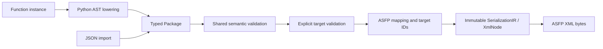

# Function compilation to ASFP

The first compiler sequence is implemented: Python Function instances lower to
typed semantic IR, then a thin Serialization IR and AutoSuite ASFP XML. The target
is AutoSuite 2.47.1.1. Application, global binding and device tasks remain deferred.

## Run the example

```bash
uv run python examples/function_call.py
```

This writes `dist/function_call.asfp` and `dist/function_call.ir.json` outside the
reference corpus. The example is based on `Test12_FIXED_CallBinding_RealInOut.asfp`:
an identity function accepts real `x` and writes real `y`; its caller passes `2.5`
and binds the output to internal variable `result`. Function names and generated
IDs differ; structure and parameter binding relationships match the fixture.

## Public API

```python
from sciloom.backends.autosuite import AutoSuiteTarget

result = program.compile(target=AutoSuiteTarget())
result.semantic_ir
result.target_id
result.diagnostics
result.artifact.content     # UTF-8 XML bytes
result.artifact.media_type  # application/xml
result.artifact.suffix      # .asfp
result.write("dist/program.asfp")
```

The target is explicit. `AutoSuiteTarget()` selects its supported default vendor
version, 2.47.1.1; unknown versions raise `ValueError`. A different target implements
the protocol in `sciloom.compiler`. IR errors raise `IRValidationError`; target
restrictions and XML failures raise `CompilationError`, both with diagnostics.
`.compile()` never writes files or changes the source instance; `.write()` creates
parents and replaces the requested file. There is no separate transpile API.
The generic result has no XML-specific field. Backend developers can inspect
`backends.autosuite.lowering.lower_asfp` and its immutable XML records separately.

JSON authoring uses the same compiler:

```python
from pathlib import Path
from sciloom import compile_ir
from sciloom.ir import from_json

package = from_json(Path("dist/function_call.ir.json").read_text())
compile_ir(package, target=AutoSuiteTarget()).write("dist/from_json.asfp")
```

## Layer boundaries



`frontends/python/model.py` provides the model API; `frontends/python/lowering.py` analyzes source; `ir/` holds
semantics/validation; `compiler.py` coordinates format-independent compilation; `backends/autosuite/lowering.py` maps the
target; `backends/autosuite/xml.py` contains immutable XML records and encoding. The installed
package needs no reference corpus or third-party runtime dependencies to compile.

The backend owns `typeid`s, UUIDs, parameter IDs, Macro containers and XML defaults.
It currently retains fixed `.1` type identifiers. The suffix's formal meaning and
compatibility across vendor versions remain an
[open confirmation item](../autosuite/docs/05_SCHEMA_EXTRACTION_AND_CONFIRMED_STRUCTURE.md#typeid-suffix-provisional-assumption-and-open-question);
no suffix calculation or variant handling is implemented.
Internal variables become declarations on an enclosing Macro. Parameter-only
functions can contain assignments/calls directly. While/If become conditional
Macros; If/Else branches own `components` inside `SATaskCondition` tasks. Else-If
is represented as nested If/Else inside the Else branch.

Exports establish parameter types `realnumber`, `integer`, `bool` and storage
codes `5`, `3`, `11`. Boolean storage uses `-1/0`, expressions use `true/false`.
Integer/boolean unit metadata follows the observed `siunit=1, unit=s` form; this
serialization convention does not introduce a physical time type into the IR.

## Determinism and evidence

Target UUIDs derive from a digest of the semantic package plus object role/ID.
Source spans are excluded. Recompilation produces identical bytes; different
specializations receive distinct target IDs. Timestamps use a fixed zero epoch.
Unsafe expression identifiers are mapped to safe local names, with references and
call bindings using the same mapping. Macro counters avoid declared variable names.
The manual requires variable names to start with an ASCII letter; JSON names
starting with an underscore are therefore mapped even though Python would allow them.

Tests compare complete normalized trees against Test12, Test10_FIXED3, Test09 and
Test08. They ignore times, selected function names, function-list order and concrete
UUID spellings. A consistent UUID renaming preserves reference relationships;
deliberately corrupting a call parameter ID makes comparison fail. Tests also cover
JSON/Python equivalence, source preservation, boolean storage, nested control flow,
safe names and file output.

This establishes structural/reference validation, not Executor acceptance. No
official function XSD is supplied. On an AutoSuite host, import the ASFP into an
appropriate application and validate with Executor simulation before claiming
runtime acceptance. Original reference files are unchanged.
