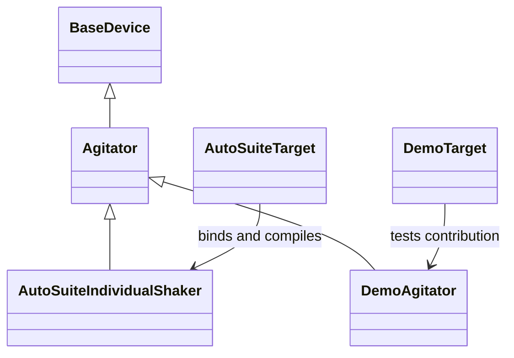
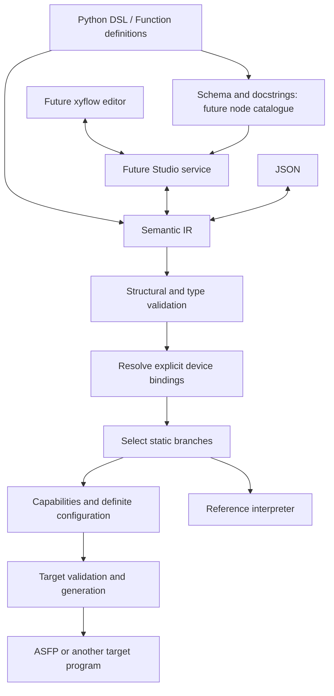

# Device contracts, staged configuration and explicit lifecycle

## Authority and status

This is the accepted interface contract for the six-stage device refactor. It
supersedes the device/lifecycle portions of the compiler-foundation and
package-layout plans when the corresponding implementation stage lands. Other
package, scalar and list contracts remain in force.

Stage 1 is merged as PR #22 (8e90e64), stage 2 as PR #23 (01fd95a).
Stage 3 implements declarative slots and explicit deployment binding;
stages 4–6 are pending. Examples of target interfaces
below are specifications, not claims of currently runnable code. Every stage
updates its callers, examples, status and tests before review and squash merge.
Do not start a later implementation stage before the preceding PR is merged.

Stage 3 retains JSON v3 and the single `set_speed`/`stop` runtime interface.
It accepts generic Agitator slots only; other category or concrete slot annotations
fail explicitly until v4 carries their declared type contracts. The deployment
object is already an immutable Agitator subclass. Stage 4 replaces the operation
interface and wire model together. This intermediate restriction avoids adding
unversioned type fields to v3 or accepting bindings without validating slot types.

| Stage | Plan | Available after merge |
|---|---|---|
| 1 | [Contract](01-contract.md) | This contract, evidence and collected Q&A |
| 2 | [Device module](02-device-module.md) | Existing device implementation in sciloom.devices; unchanged behavior |
| 3 | [Device bindings](03-device-bindings.md) | Device types, declarative slots, concrete deployment bindings |
| 4 | [Configuration lifecycle](04-configuration-lifecycle.md) | Property writes, explicit start/stop, IR/JSON v4, interpreter and AutoSuite |
| 5 | [Independent contribution](05-independent-contribution.md) | Verified independent property/command/target extension |
| 6 | [Device specialization](06-device-specialization.md) | Static device branches and JSON rebinding |

## Decision and alternatives

Device contracts describe experimental parameters and operations. Semantic IR
describes the experiment. A Target translates that IR into a platform program.
One AutoSuiteTarget can support multiple concrete AutoSuite device profiles.

Parameter assignment stages a value; explicit start applies the complete stored
configuration. Combining assignment with implicit start prevents coordinated
multi-parameter changes. Merely accumulating Python AST expressions until the
next lexical start is also incorrect: values must be captured at runtime, through
branches, loops and function calls. Keep that intent in IR rather than flattening
it into XML-oriented nodes in the DSL.

## Ownership and architecture

| Location | Responsibility |
|---|---|
| sciloom | Lazy experiment-author imports |
| sciloom.devices | BaseDevice, device family contracts, member declarations |
| sciloom.dsl | Device-slot schema and restricted Python source conversion |
| sciloom.core.ir | Typed device resources, contracts, configuration and commands |
| sciloom.core.devices | Immutable binding facts without Python device classes |
| sciloom.core.specialization | Pure selection of device-dependent branches |
| sciloom.core.compiler | Target protocol, validation pipeline and artifacts |
| sciloom.core.interpreter | Reference sessions and configuration/applied snapshots |
| sciloom.contrib.autosuite | Concrete profiles, deployment checks and XML generation |

Core must not import devices, DSL, contrib or Studio. Units remain independent.
BaseDevice does not impose start/stop on every device family. Agitator owns that
family's lifecycle. Concrete profiles are immutable deployment descriptions, not
live hardware connections. Independent packages need no plugin discovery or
installation into the sciloom.contrib namespace.





GUI layout remains outside semantic state. No GUI/server implementation is part
of this sequence. Docstrings provide descriptions, not executable constraints.

## Author API (stage 4)

```python
from sciloom import Agitator, Function, Input, RotationalSpeed, runtime
from sciloom.contrib.autosuite import AutoSuiteIndividualShaker, AutoSuiteTarget


class ConfigureAgitation(Function):
    """Configure and switch a logical agitator.

    Attributes:
        agitator: Logical device used by this experiment.
        speed: Target rotational speed when starting.
        enabled: Whether to start agitation or stop it.
    """

    agitator: Agitator
    speed: Input[RotationalSpeed]
    enabled: Input[bool]

    @runtime
    def run(self) -> None:
        if self.enabled:
            self.agitator.speed = self.speed
            self.agitator.start()
        else:
            self.agitator.stop()


compiled = ConfigureAgitation().compile(
    target=AutoSuiteTarget(devices={
        "agitator": AutoSuiteIndividualShaker(
            zone="Heater Shaker 23", device_id="23",
        ),
    }),
)
compiled.write("agitation.asfp")
```

The enabled branch stores the speed, then emits a Stir command with switchon=1.
The other branch emits switchon=0. Compilation performs no hardware action.

Device annotations create logical slots independently of Input/Output/Var.
Ordinary unwrapped numeric annotations still mean host configuration. Root slot
names are field names; nested slots use component paths such as stage.agitator.
Host assignment of a compatible logical reference shares one resource:

```python
def __init__(self) -> None:
    self.stage = ConfigureAgitation()
    self.stage.agitator = self.agitator
```

Materialize deterministic identities for the instance graph, including shared
Function instances. Reject incompatible references and cyclic slot aliases.
Concrete devices are bound only by Target. Reject missing/unknown bindings,
incompatible families and unsupported physical aliasing. Declared dependencies
require bindings; lack of a binding never means a false capability query.

Stage 3 changes composition/binding APIs but retains the existing set_speed/stop
runtime language as the only implemented lifecycle. Stage 4 migrates all calls
to property/start/stop and removes set_speed/SetAgitation together. Do not add
forwarding aliases for Agitator("name"), IndividualShakerBinding or agitators=.

## Runtime configuration contract (stage 4)

| Action | Meaning |
|---|---|
| device.speed = expression | Evaluate now and copy into resource configuration |
| device.start() | Snapshot the complete configuration, apply it and enable |
| start while enabled | Reapply current complete configuration and remain enabled |
| device.stop() | Disable; retain configured and last-applied snapshots |
| write while enabled | Change configured values only, not applied values |
| device.speed = 0 * rpm | Configure zero; does not stop or provide an implicit default |

Keep configured values, applied values and enabled state distinct. Configuration
belongs to a logical resource shared across calls in a session. Fresh sessions
and distinct resources are independent. List values follow existing copy/tuple
semantics; old result/event snapshots must not change after subsequent writes.

```python
self.agitator.speed = self.speed
self.speed = 0 * rpm
self.agitator.start()  # Uses the previously captured value.
```

The snippet illustrates capture semantics in a context where speed is writable;
the complete author example above does not modify its input.

Required configuration starts unset. Compilation requires definite configuration
within each entry invocation, including transitive calls, without assuming any
previous entry execution. A possibly zero-iteration loop cannot establish it.
Thus a program that configures only on some entry invocations and otherwise starts
from historical state is rejected by the compiler, even though the reference
session retains that state. Retention does not waive this conservative compile
check. Direct reference execution checks actual state: starting unset fails on
the first call; a later start can use retained configuration. This execution
capability does not imply that the compiler accepts an unproved entry path.
Reference sessions preserve writes before failures; target recovery equivalence
remains limited as recorded in [Q&A](qa.md).

Property reads, augmented assignments and indexed mutation of device properties
are initially unsupported. A typing getter is not hardware telemetry. Start does
not wait for measured speed attainment, enforce a duration or automatically stop.

## Contributor declarations (stage 4; independent proof at stage 5)

```python
from dataclasses import dataclass
from typing import Callable, ClassVar
from sciloom.devices import Agitator, operation


@dataclass(frozen=True, kw_only=True)
class DemoAgitator(Agitator):
    """A test fixture, not an actual hardware profile."""

    device_type_id: ClassVar[str] = "example.demo-agitator/v1"
    writable_properties: ClassVar[tuple[str, ...]] = ("speed", "gain")
    required_configuration: ClassVar[tuple[str, ...]] = ("speed", "gain")
    @property
    def gain(self) -> float:
        raise TypeError("Device property reads are not supported yet.")

    @gain.setter
    @operation(id="example.demo-agitator.gain/v1")
    def gain(self, value: float) -> None:
        """Stage the gain for the next start."""

    @operation(id="example.demo-agitator.calibrate/v1")
    def calibrate(self) -> None:
        """Record a test-only calibration command; no actual hardware exists."""

    supported_operations: ClassVar[
        tuple[Callable[..., None], ...]
    ] = (Agitator.start, Agitator.stop, calibrate)
```

The operation decorator preserves ParamSpec/return typing and prevents ordinary
host invocation. Inspect declarations statically; never execute descriptors or
method bodies to discover capabilities. A decorated property setter is a
configuration declaration; a decorated ordinary method is a command declaration.
Setter value type must match its getter type, with one value argument and None
return. Commands return None, use supported semantic argument types and reject
variadic/untyped declarations. Inheritance does not grant implementation support.
Profiles explicitly declare writable properties, commands and the parameters
required by start. Preserve the contract of inherited members.

Semantic identifiers are namespaced and versioned. Copy/freeze declaration data.
Support current scalar, physical and homogeneous-list types; no arbitrary Python
objects or new quantity system. Test the contribution boundary with an additional
independent command and a recording target that handles it without core changes.
The test target also checks gain in [0, 1]: reject invalid constants and runtime
values whose compliance cannot be proved. No invented AutoSuite gain mapping.

## Compiler and binding interface

Stage 3 introduces this data-only deployment envelope. A binding identifies one
logical resource and one physical identity within its target. Compatibility uses
stable semantic IDs, not Python classes. Constructors freeze collection inputs;
duplicate logical/physical identities fail:

```python
from sciloom.core.devices import DeviceBinding, DeviceBindings

bindings = DeviceBindings(devices=(DeviceBinding(
    logical_id="agitator",
    device_type_id="sciloom.autosuite.individual-shaker/v1",
    compatible_type_ids=("sciloom.agitator/v1",),
    physical_id="autosuite:individual-shaker:23",
),))
assert bindings.devices[0].logical_id == "agitator"
```

These identity fields are current from stage 3. Stages 4/5 extend binding facts
with trusted property/operation contracts required by the v4 directory; stage 6
uses them for branch selection. No serialized implementation ID is dynamically
imported.

Stage 3 introduces immutable binding facts and explicit deployment resolution.
The final protocol and result behavior (complete at stage 6) are:

```python
from typing import Protocol
from sciloom.core.compiler import Artifact
from sciloom.core.devices import DeviceBindings
from sciloom.core.diagnostics import Diagnostic
from sciloom.core.ir import Program


class Target(Protocol):
    @property
    def target_id(self) -> str: ...
    def resolve_devices(self, program: Program) -> DeviceBindings: ...
    def validate(self, program: Program) -> tuple[Diagnostic, ...]: ...
    def emit(self, program: Program) -> Artifact: ...


class SummaryTarget:
    """Minimal independent target for a device-free program."""

    target_id = "example.summary/v1"

    def resolve_devices(self, program: Program) -> DeviceBindings:
        return DeviceBindings()

    def validate(self, program: Program) -> tuple[Diagnostic, ...]:
        return ()

    def emit(self, program: Program) -> Artifact:
        return Artifact(
            content=f"functions={len(program.functions)}\n".encode(),
            media_type="text/plain", suffix=".txt",
        )
```

The shown Protocol documents the real core.compiler.Target; it is not another
interface to install. A one-function device-free program compiled through
compile_ir(program, target=SummaryTarget()) yields b"functions=1\n".
An empty DeviceBindings cannot satisfy a program with device dependencies.
Binding facts contain logical identity, concrete type ancestry and trusted member
contracts/support/requirements, never Python classes or hardware addresses.

```python
from sciloom.core.compiler import compile_ir
from sciloom.core.ir import from_json, to_json
from sciloom.core.specialization import specialize

program = function.to_ir()  # Target-independent, retains static branches.
restored = from_json(to_json(program))
selected = specialize(restored, bindings=target.resolve_devices(restored))
result = compile_ir(restored, target=target)
assert result.semantic_ir == restored
assert result.specialized_ir == selected
```

The developer fragment assumes a declared function and target as above. The
compiler validates authored IR, resolves bindings once, specializes, validates
retained capabilities/definite configuration, runs target validation and emits.
Target.validate and Target.emit receive only the selected/specialized Program;
Target.resolve_devices receives the authored Program. CompileResult.semantic_ir
remains the authored Program, and specialized_ir is the selected Program sent to
the backend. Unresolved static branches never reach target validation/emission.
specialize is pure and retains source locations/identities. Both result IRs remain
high-level; backend working variables and hidden parameters belong below them.

## IR and JSON v4 (stage 4)

Introduce DeviceResource, ConfigureProperty, StartAgitation, StopAgitation,
DeviceCommand, typed static predicates/branches, and a declarative member/type
catalogue. ConfigureProperty carries resource/property IDs and a typed expression;
StartAgitation consumes stored configuration rather than a delayed source AST.
Generic extension commands refer to versioned IDs and named typed arguments.
The catalogue includes receiver requirements and type ancestry.

Define the whole v4 wire vocabulary in stage 4, including nodes whose execution
is not yet wired. Strictly reject unknown fields, invalid contracts/references,
duplicate IDs, unsupported types and prior versions. Until their stage lands,
execution/compilation of unsupported nodes reports an explicit diagnostic.
No parallel v3 decoder or compatibility SetAgitation node. Regenerate all live
JSON/ASFP artifacts; v4 and device identities can change semantic UUID hashes.

JSON loading validates data without imports. Built-in contracts must match their
canonical definitions. For selected extensions, compare serialized declarations
to the explicitly supplied trusted target contracts. An inactive extension can
round-trip and compile without its Python package installed. No importlib or
entry-point lookup based on serialized IDs.

## Compile-time queries (stage 6)

```python
from sciloom import comptime

if comptime.is_device(self.agitator, DemoAgitator):
    self.agitator.gain = 0.5
self.agitator.speed = self.speed
self.agitator.start()
```

With DemoAgitator, retain gain and speed configuration before start; with AutoSuite,
remove the gain branch. is_device provides TypeGuard narrowing and means the
declared type or its subtypes. supports(device, Agitator.start) checks registered
commands; can_write(device, "gain") checks a declared literal property name.
supports does not accept a property/getter. Do not add can_read before reads exist.

Queries appear only in if/elif conditions, with nesting for combinations. Runtime
conditions remain separate. Inspect known marker objects without invoking them;
ordinary host calls raise. All branches must be valid typed DSL/IR. Only retained
branches require device implementation support and target legality. Missing
bindings are errors, never false queries. Prune unreachable functions after
selection. Interpreter requires resolved branches and rejects unknown commands.

## AutoSuite backend (stage 4)

The supported Stir task submits speed and on/off together. Store configuration in
target-private variables at assignment time; start emits Stir(speed=stored value,
switchon=1), stop emits switchon=0. Do not stage speed using a disabled Stir task.

Use one resource context across the call graph: entry-owned persistent storage,
hidden callee inputs/outputs for configuration, and output initialization from
inputs so unchanged branches preserve it. Keep author entry signatures unchanged.
Thread transitive calls and aliases consistently; configuration is not one
unrelated local record per Function. Internal numeric zero initializers do not
establish semantic configuration: prove definite configuration before starts.
Test both parent-configure/child-start and child-configure/parent-start.

Normal-return context threading does not establish recovery equivalence after a
callee failure before copy-out. Hardware faults remain fatal; do not add public
globals, recovery or claim full post-failure state equivalence. See QA-004.

Validate documented profile constraints; invalid constants and unprovable bounded
inputs fail compilation. Do not invent speed ranges, clamp values or emit
unconfirmed runtime guards. Current speed quantity rules still apply.

## Evidence and limits

See [existing mapping evidence](../../../autosuite/docs/16_AGITATION_MAPPING.md).
The latest [Sample and Run GPC](../../../autosuite/extracted/latest_app/functions/24_Sample%20and%20Run%20GPC.asfp)
stops, calls sampling, then starts with an explicit shaker_speed expression.
[functionsPackage_3](../../../autosuite/asfp/functionsPackage_3.asfp) likewise has
Stir, thermal tasks, Wait and a later stop. Timing is outside the Stir payload.

Manual 3.6.19 (p73–74) describes Stir state/speed; 3.6.24 (p76–77) describes Wait
preserving peripheral states. Driver Manager 5.2 (p201–202) separately documents
IController SETPOINT/START/STOP/WAIT/HOLD. This is not proof those commands can be
serialized as individual-shaker ASFP operations. No such speed/start bridge was
found in the retained corpus. Older rotation-mode Set Node Value tasks are not
evidence for an independent speed-setpoint task. Raw evidence remains unchanged.

## Acceptance and non-goals

Every code stage runs pytest src/sciloom, mypy, AutoSuite smoke, recipe validation,
all current author/developer examples, proposed-example syntax checks and git
diff --check. Use uv run for Python tools; CI covers Python 3.12–3.14. Maintain the
explicit mypy test-module exceptions as tests are added/moved. Stage 2 preserves
artifact bytes; later semantic changes regenerate committed companions.

Verify slot identity/sharing, host protection, property typing, capture timing,
staged/applied snapshot separation, missing configuration, repeated start/stop,
zero-iteration loops, transitive calls, session isolation, extension contracts,
JSON round-trips, direct-IR/source equivalence and target-free core imports.
Add positive/negative mypy examples, including wrong property types and TypeGuard.

Keep short learning outputs in module docstrings and long outputs in same-basename
companions. Update live architecture/DSL/reference execution docs and AGENTS with
each implemented stage; mark old plans superseded for their changed portions.
For changes to files tracked in autosuite/MANIFEST.csv (including reference docs),
update their hashes and run audit_corpus.py. Project docs under docs/ do not require
manifest updates. Do not change raw evidence to satisfy a compiler test. Static XML
checks do not establish Executor acceptance; retain the real simulation gate.

No GUI/server, public Application/global API, measured getters, general time model,
new real device features, arbitrary Python evaluation, Notebook or exec support.
Collect experimental questions in [Q&A](qa.md), with provisional decisions;
do not interrupt implementation to ask them individually.
