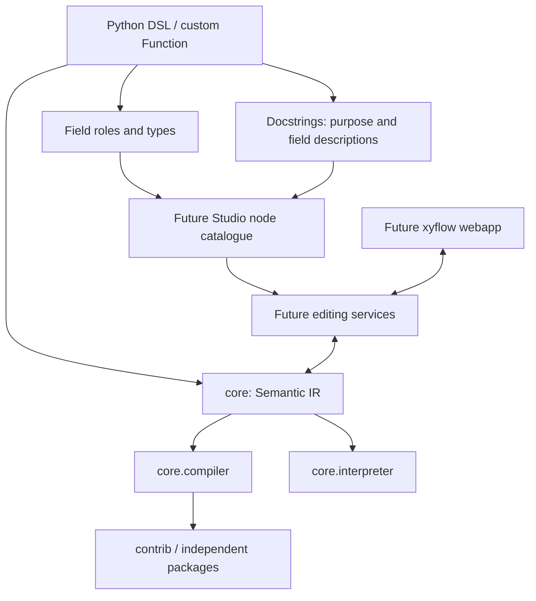

# Package layout, native declarations and runtime lists

## Status and authority

This is the accepted interface contract for the nine-stage refactor. It supersedes
the package layout in the compiler-foundation and autosuite-codegen plans, and
the plain-ScalarType field spelling in the semantic-ir plan. Stage numbers below
refer to this sequence, not GitHub PR numbers. Until its implementing stage lands,
a target example is a specification, not a claim that it has already run.

The decision separates Python value types from runtime field roles. It keeps the
semantic IR independent of Python source, GUI frameworks and equipment vendors.
Alternative Generic wrapper classes would obscure native values from type checkers;
compatibility shims would create competing interfaces. Neither is introduced.

## Ordered stages and availability

| Stage | Plan | Capability available after merge |
|---|---|---|
| 1 | [Contract](01-contract.md) | Workflow rule and this design; no new runtime API |
| 2 | [Core layout](02-core-layout.md) | core.ir, core.compiler, core.diagnostics, core.interpreter |
| 3 | [DSL and contrib](03-dsl-contrib.md) | dsl and contrib.autosuite; author-only root exports |
| 4 | [Responsibilities](04-responsibilities.md) | Cohesive conversion, execution and emission modules |
| 5 | [Native declarations](05-native-declarations.md) | Input/Output/Var with native scalar types |
| 6 | [List semantics](06-list-semantics.md) | Direct list IR, JSON v3, reference execution; target rejects lists |
| 7 | [List DSL](07-list-dsl.md) | Python list source to IR and reference execution |
| 8 | [AutoSuite lists](08-autosuite-lists.md) | List compilation and complete learning examples |
| 9 | [Typing](09-typing.md) | Reproducible mypy checks and positive/negative contracts |

Each stage must pass review, fixes, latest-head CI and remote squash merge before
the next stage starts. Each move updates imports, tests and live documentation in
the same PR. No temporary aliases, plugins or later-stage parallel implementation.

## Package ownership

| Package/module | Owns |
|---|---|
| sciloom | Lazy experiment-author exports |
| sciloom.dsl | Field declarations, model instances, Python source lowering |
| sciloom.units | Independent physical values and units shared by authoring/core |
| sciloom.core.ir | Types, semantic records, structural codec, semantic validation |
| sciloom.core.compiler | Target protocol, generic pipeline, artifacts/results |
| sciloom.core.diagnostics | Diagnostics, errors and source locations |
| sciloom.core.interpreter | Values, evaluation and reference sessions |
| sciloom.contrib.autosuite | Version/bindings, legality, code generation, XML |
| sciloom.studio (future) | Node catalogue, graph projection, editing services/server |
| web/ (future, repository root) | TypeScript/React/xyflow application |

core may use units; it must not import dsl, contrib or studio. Root imports remain
lazy so direct IR/JSON execution does not load Python authoring. Internal consumers
import the owning module, not root re-exports. Tests stay beside their source.
studio/web are documentation boundaries only in this sequence: no placeholder
implementation, web dependency, node registry or HTTP framework is added.

## Author API (scalar declarations: stage 5; complete example: stage 8)

```python
from sciloom import Function, Input, Output, Var, runtime
from sciloom.contrib.autosuite import AutoSuiteTarget


class ScaleValues(Function):
    """Copy a list and multiply each element by the supplied factor.

    Attributes:
        values: Input numbers; writes to result never modify this list.
        factor: Multiplication factor.
        result: Independent scaled values.
        index: Persistent internal index, explicitly reset for each call.
    """

    values: Input[list[float]]
    factor: Input[float]
    result: Output[list[float]]
    index: Var[int] = 0
    batch_size: int = 8  # Host configuration, not a runtime field.

    @runtime
    def run(self) -> None:
        self.result = self.values
        self.index = 0
        while self.index < len(self.result):
            self.result[self.index] *= self.factor
            self.index += 1


compiled = ScaleValues().compile(target=AutoSuiteTarget())
compiled.write("scale_values.asfp")
```

The final root exports are Function, Input, Output, Var, runtime, Agitator,
RotationalSpeed, rpm and rps. Real/Integer/Boolean are replaced by float/int/bool.
Target, Artifact, CompileResult and compile_ir are imported from core.compiler.
RuntimeField belongs to the DSL schema implementation. Function.to_ir() remains
available to developers; Function.compile(target=...) remains the author entry.

Only Input[T], Output[T] and Var[T] declare runtime fields. Bare native/physical
annotations are host data. Var needs an explicit initial value. Initial values
initialize session state, not each call; runtime assignment performs a reset.
Scope follows the owning model. Application/global compilation remains deferred.

The implementation uses generic Annotated aliases (TypeAlias plus TypeVar) with
one private field-role marker. get_type_hints(include_extras=True) preserves it;
ordinary type checkers see T. Reject unsubscripted aliases, multiple/nested roles,
Any and unsupported types. Keep descriptors preventing host reads/writes.
ScalarType.REAL/INTEGER/BOOLEAN and vendor storage codes remain internal.

## Contributor contract (new imports: stage 2)

```python
from typing import Protocol
from sciloom.core.compiler import Artifact
from sciloom.core.diagnostics import Diagnostic
from sciloom.core.ir import Program


class Target(Protocol):
    @property
    def target_id(self) -> str: ...
    def validate(self, program: Program) -> tuple[Diagnostic, ...]: ...
    def emit(self, program: Program) -> Artifact: ...


class SummaryTarget:
    target_id = "summary"

    def validate(self, program: Program) -> tuple[Diagnostic, ...]:
        return ()

    def emit(self, program: Program) -> Artifact:
        return Artifact(
            content=f"functions={len(program.functions)}\n".encode(),
            media_type="text/plain",
            suffix=".txt",
        )
```

This illustrates the existing protocol, not a second Target definition to install.
An independent package imports the real Target or structurally implements it.
compile_ir(program, target=SummaryTarget()) returns CompileResult; a one-function
program produces b"functions=1\n". No namespace-package installation or plugin
discovery is required. Generic compilation validates IR, validates the target,
then emits; neither parsing Python nor choosing XML belongs to that pipeline.

## List semantics (IR: stage 6; Python: stage 7; AutoSuite: stage 8)

One-dimensional homogeneous lists support int, float, bool and RotationalSpeed.
Use list[T], never bare list, list[Any], nested or mixed lists. Preserve intent:

```python
@dataclass(frozen=True, kw_only=True)
class ListType:
    element_type: ScalarType

ValueType = ScalarType | ListType
```

Lists have construction, length, index-read and index-write nodes; the frontend
must not replace them with AutoSuite tasks. List literal elements can be runtime
expressions; class initializers must contain constants. Empty literals obtain
their element type from the declaration/call context. Compatible scalar literals
may widen int to float; list variables require identical element types.

Supported source is list literals/defaults, whole assignment, function I/O,
len, index reads, index writes/augmented writes and existing if/while. First-stage
function output bindings remain whole variables: indexed call-result targets are
rejected explicitly. Slices, implicit iteration, comprehensions, truthiness,
list comparisons/arithmetic and append/pop/remove/clear are unsupported.

Values copy on assignment and across function boundaries:

```python
self.b = self.a
self.b[0] = 9
# a does not change.
```

Freeze class defaults and runtime list values as tuples. Updates replace the
target value. Distinct specialized instances and sessions do not share mutable
state; repeated calls to one function retain its internal state. Public execution
snapshots expose tuples for lists and remain detached/read-only.

Indices must be nonnegative integers, excluding bool. Negative or out-of-range
reads/writes raise ExecutionError; writes never grow a list. Preserve expression
evaluation order, including evaluating augmented assignment's target/index once.
Failure does not roll back preceding state writes, matching scalar execution.

JSON becomes v3 only in stage 6. Update strict enum/dataclass union decoding,
reject unknown fields/types/versions, and migrate all live examples; no parallel
v2 reader. Pure moves/native declaration changes preserve ASFP bytes. The v3
version change can alter UUID hashes, so later artifact regeneration must record
that cause rather than promise unchanged bytes across the entire sequence.

## AutoSuite list mapping and evidence

Array initialization uses values/count/valueN plus the element storage type and
array=1. I/O uses element variabletype plus isarray=1. len maps to ArraySize.
Index writes use the whole variable name, elementselectmode=0 and elementnumber;
whole-list assignment uses observed mode 4. Array input bindings use variablename,
not the expression field used for scalar inputs. Keep parameter IDs consistent.

Private temporary arrays isolate call inputs and outputs from possible vendor
aliasing. Runtime list literals are materialized in private arrays, not emitted
as undocumented Python-like expression strings. Do not prematurely lower list
intent in the shared IR.

Use a checked read before an index write to prevent vendor auto-growth. Capture
the index once; route a negative index to ArraySize(array), an invalid upper-bound
read. Such reads are observable checks and must not be optimized away. Target
expression generation carries prerequisite tasks. For a while condition with
prerequisites, evaluate them before the first test and again after each completed
body, using a private condition variable so checks run on every condition test.

Evidence:
- latest APP / extracted 51_Non Zero Array Min: array input, ArraySize, index reads;
- extracted 44_Set ISynth Drawer State: indexed SetVariable;
- config20260902_2.app: whole-array mode 4;
- Suzuki-Miyaura-automation.app: integer and dimensionless numeric arrays;
- manual 3.8.5: homogeneous zero-based arrays and upper-bound read errors;
- array input calls: variablename binding, distinct from scalar expression binding.

Boolean-array wire combinations and the generated bounds-check sequence are
derived mappings, not directly re-exported fixtures; document their evidence
grade and pending Executor confirmation. No append/pop/remove/clear use was found
in raw APP/ASFP. CSV and indexed writes do grow arrays in existing programs:
record that future construction need without silently adopting auto-growing
indexed assignment in SciLoom.

The new Non Zero Array Min learning example preserves the numeric algorithm but
explicitly removes volume units; it is not a full physical-unit reconstruction.
Separate tests cover copy isolation, writes, list literals and parameter passing.

## Documentation, Studio and typing



Class docstrings describe purpose and Attributes keyed by actual field names;
constructor Args describe host configuration. Do not duplicate types or turn
prose into executable constraints. Future Studio derives ports from schema and
help text from docs; GUI edits IR directly, without regenerating Python for every
edit. Layout is separate. Generic Function composition is user extension; new
primitive semantics require contributor work. Canonical Python export is future
work, not exact reconstruction of comments or host generation code.

Update all live Mermaid architecture/data-flow diagrams and explanatory paths
when their stage lands; retain historical diagrams with supersession notices.
Distinguish current capabilities, target design and future Studio/web services.

Stage 9 adds mypy as a locked development dependency and CI command (uv run mypy).
Check core/contrib production functions, excluding test/conftest entrypoints,
with check_untyped_defs and complete function annotations; do not enable blanket
whole-repository strict or globally ignore imports. Preserve py.typed. Check
correct/incorrect Target implementations, IR/Artifact constructors and native
Annotated field inference/defaults. Preserve runtime decorator signatures.
No plugin or claim of full Function-call/host-access/device checking is made.
IR validation remains authoritative for Python, GUI, AI and external JSON.

## Shared acceptance

Every code stage runs:
```bash
uv run pytest src/sciloom
uv run python autosuite/tools/smoke_test.py
uv run python autosuite/recipe/validate_recipe.py autosuite/recipe/input_0908.csv
uv run python examples/function_call.py
uv run python examples/agitation.py
uv run python -m examples.developer.agitation_ir
uv run python -m compileall -q examples/proposed_frontend
git diff --check
```

CI covers Python 3.12/3.13/3.14. Verify package/import isolation, raw corpus paths,
native-role validation, list defaults across instances/sessions, persistent state,
detached snapshots, copy-in/copy-out, empty/bad indices/types, JSON round trips and
direct-IR/Python execution agreement. Learning outputs come from actual runs and
live beside same-base-name code. Do not overwrite raw evidence. After reference
documentation changes update MANIFEST hashes and run audit_corpus.py.
Static XML/reference checks do not establish Executor acceptance or physical
equivalence; retain the AutoSuite host simulation gate.

