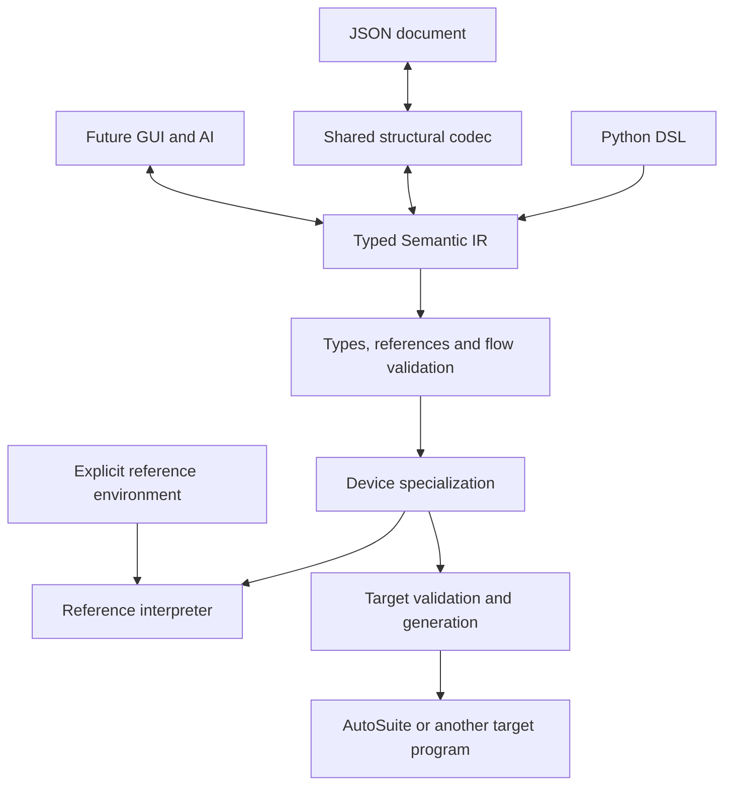

# Durable IR and twelve runtime capabilities

## Goal

Grow SciLoom's runtime vocabulary while preserving existing programs. The typed
Semantic IR remains the common model for Python, JSON, future GUI editing and AI.
CSV, location selection and timing retain their high-level intent until target
generation. A new operation is not automatically a new interchange format.

Accepted by the user on 2026-09-16. The starting point is audit PR #84, merged at
`21557ef84a1947c8e89914f60030f8b3f9eac5be`; both workspace packages are 0.2.0.
The [audit](../../../autosuite/docs/18_CAPABILITY_GAPS_AND_ZONE_PARAMETERS.md)
defines A01–A12 and distinguishes them from broader or unsupported capabilities.

## Authoritative contract

[01-contract.md](01-contract.md) is the single interface and behavior agreement.
Every stage below links to it; update the contract, affected stage plans and
callers together when an implementation decision changes an interface.
The examples describe target interfaces, not already executed programs, except
where explicitly marked current. Implemented behavior remains documented in the
[public handbook](../../../website/docs/index.md).

This decision replaces the earlier conversational proposal to introduce JSON
v5 and an offline migration before adding the twelve features. It does not undo
the historical v2/v3/v4 migrations recorded in earlier refactors.

## Architecture and consequences



- Keep `format_version: 4`. Freeze existing kinds, fields and meanings; add new
  vocabulary without rewriting old documents. Old tools may reject new kinds.
- Declare stable wire kinds on the serializable dataclasses. Do not derive them
  from Python class names, maintain a second schema, or dynamically import IDs.
- Reuse device property/command contracts. Add nodes for new value types,
  result-producing behavior, control flow or resource scope when required.
- Land each node with its feature and explicit handling/rejection in consumers.
  Do not publish a catalog of future placeholder nodes first.
- Preserve immutable values, ordered effects and high-level structured flow.
  Explicitly handle every node; remove dispatch that treats an unknown remainder
  as a Call, Binary or another known node.
- Keep author vocabulary in flow/devices, source analysis in dsl, semantics in
  core, and AutoSuite mapping in the independent workspace member. Root imports
  remain lazy. Core never imports the author vocabulary or target implementation.
- Separate saved logical-device configuration from the physical controllers
  affected by dynamic location selection. Backend context stays out of Program.

A catch-all operation dictionary was rejected because it moves type, scope and
effect checks into ad-hoc consumers. A global format bump per feature was rejected
because new vocabulary does not require changing existing documents. A separate
handwritten JSON model was rejected because it duplicates the typed definitions.

## Stage status and sequence

Stages 0–6 merged as PRs #85–91. Stage 7 implements explicit acknowledgement;
stages 8–17 remain pending. Update this table in the stage that implements an
outcome and record its PR and verification.

| Stage | Plan | Outcome | Status |
| --- | --- | --- | --- |
| 0 | [Record contract](02-plan-contract.md) | Interfaces, sequence, evidence gates and Q&A | Merged, PR #85 |
| 1 | [Wire contract](03-plan-wire-contract.md) | Stable kinds, v4 baselines, consumer completeness | Merged, PR #86 |
| 2 | [Text](04-plan-text.md) | A01 text and text lists | Merged, PR #87 |
| 3 | [Quantities](05-plan-quantities.md) | A02 volume and time | Merged, PR #88 |
| 4 | [Numeric operations](06-plan-numeric.md) | A11 abs, floor and round | Merged, PR #89 |
| 5 | [Reference environment](07-plan-environment.md) | Explicit environment and ordered external events | Merged, PR #90 |
| 6 | [Logging](08-plan-logging.md) | A09 typed log events | Merged, PR #91 |
| 7 | [Confirmation](09-plan-confirmation.md) | A10 acknowledged messages | Implemented; acceptance/review pending |
| 8 | [Failure propagation](10-plan-failure.md) | Verified AutoSuite runtime-failure boundary | Pending |
| 9 | [Wall clock](11-plan-wall-clock.md) | A12 formatted wall-clock reads | Pending |
| 10 | [Wait and timer](12-plan-timing.md) | A08 durations and elapsed-time waits | Pending |
| 11 | [CSV reads](13-plan-csv-read.md) | A05 row/column reads and typed results | Pending |
| 12 | [CSV append](14-plan-csv-append.md) | A06 bounded row append | Pending |
| 13 | [Zone values](15-plan-zone-values.md) | A03 values and read-only deployment directory | Pending |
| 14 | [Zone traversal](16-plan-zone-traversal.md) | A04 indexing and sequential fragments | Pending |
| 15 | [Well properties](17-plan-well-properties.md) | A07 stored text properties | Pending |
| 16 | [Dynamic locations](18-plan-dynamic-locations.md) | A03 candidate binding and physical state | Pending |
| 17 | [Integrated examples](19-plan-integration.md) | Three complete workflows and handbook coverage | Pending |

For each stage: review, address feedback, run latest-head checks, squash merge,
confirm remote MERGED state, then branch from updated main. Do not begin a later
stage while the preceding PR remains open. This applies to stage 0 as well.

## Acceptance shared by code stages

Run the existing CI commands from the repository root:

```console
uv run ruff check
uv run ruff format --check
uv run mypy
uv run pytest src/sciloom packages/sciloom-autosuite/src examples
uv run python autosuite/tools/smoke_test.py
uv run python autosuite/recipe/validate_recipe.py autosuite/recipe/input_0908.csv
uv run python -m compileall -q examples/proposed_frontend
uv run --group docs python website/tools/site.py build --strict
uv run --group docs pytest website/tools
git diff --check
```

Run every current author/developer example listed in CI and each example added
by the stage. Check companion reproducibility and no unintended tracked changes.
Maintain the mypy test-module exception list, runnable-example checks, API pages
and explicit public-download list. CI continues to cover Python 3.12–3.14.

Preserve pre-change v4 semantic and canonical-byte fixtures. Compare Python,
direct IR and JSON execution. Test class-renaming independence, unknown inputs,
immutable snapshots, effect order and consumer coverage. Physical and numerical
equivalence require separate evidence, not just round trips or XML parsing.

The [evidence matrix](20-evidence.md) controls platform claims. The corpus is
read-only and not published. Run corpus audit after reference-document changes.
Collect questions in [Q&A](21-qa.md), without interrupting the user for each
experimental uncertainty.

## Non-goals

No SSA, generic pass framework, dynamic plugin discovery, arbitrary dict IR,
implicit migration, additional format reader, GUI/server, Application/global
state, telemetry getter, new liquid-handling device or instrument I/O executor.
Do not extend an author/device contract merely to imitate vendor XML.

## Version

Version: PATCH 0.3.5 → 0.3.6 for stage 7, following the user's lockstep 0.3.x decision.
By explicit user decision, the first shipped-code
stage moves both packages from 0.2.0 to 0.3.0; later shipped-code stages remain
lockstep in 0.3.x. This is an exception to the usual per-capability minor-bump
rule, not an instruction to bump to 1.0.0. JSON stays v4. No release tag or PyPI
publication is authorized by this sequence.
