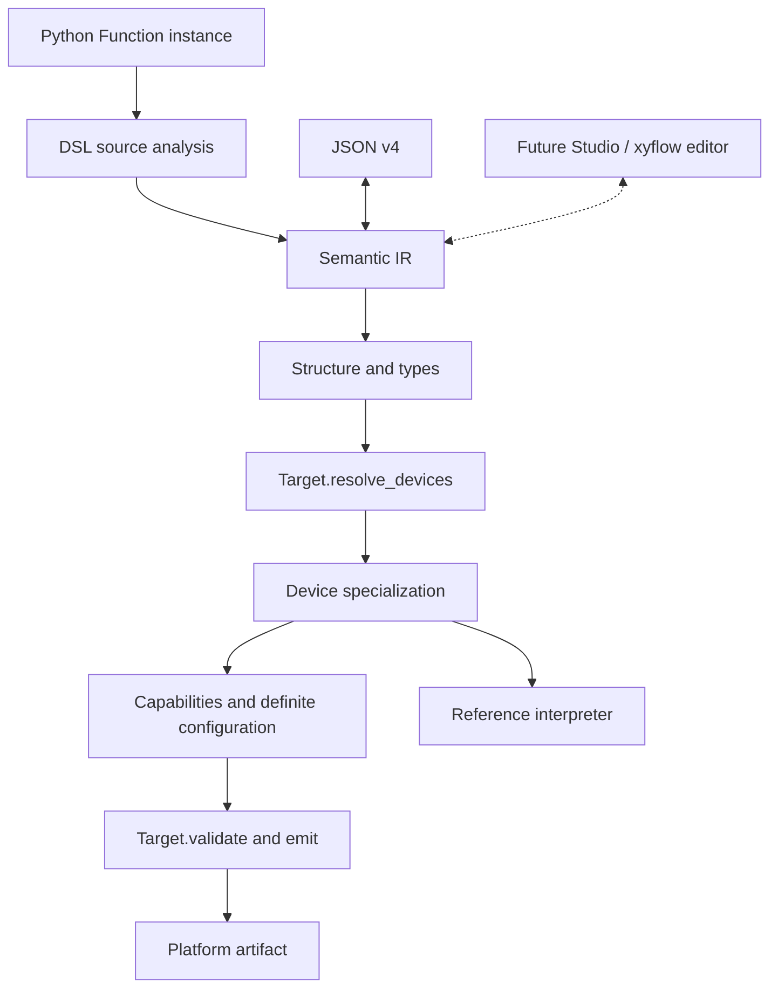

# Architecture and ownership

The typed semantic Program is the source of execution meaning. Python is the
authoring DSL; targets own platform-specific validation and serialization.

| Package | Responsibility |
|---|---|
| sciloom | Lazy experiment-author imports |
| sciloom.dsl | Schemas, composition and restricted Python source conversion |
| sciloom.units | Independent physical quantities |
| sciloom.devices | Python device families and member declarations |
| sciloom.core.ir | Typed nodes/types, validation and JSON |
| sciloom.core.compiler | Target protocol, pipeline and artifacts |
| sciloom.core.devices / specialization | Data-only binding facts and branch selection |
| sciloom.core.interpreter | Reference execution sessions |
| sciloom.core.diagnostics | Errors, diagnostics and source spans |
| sciloom.contrib.autosuite | AutoSuite device profiles, legality and XML generation |

Core imports neither the Python DSL/device classes nor any target. Independent
equipment packages implement the same Target protocol without joining the contrib
namespace or registering a plugin. Unit types remain independent.

Within the DSL, model/schema construction, source discovery, expression conversion
and statement/control-flow conversion have separate responsibilities. IR structure
checking, expression typing, program validation and JSON conversion are distinct.
The interpreter separates values, expression evaluation and session/device state.
AutoSuite code generation retains a thin serialization model below semantic IR.

## Future editing tools

Studio will compose semantic IR directly. Function schemas can describe node ports
and docstrings can describe their purpose. Layout stays outside semantic state.
The GUI, node catalogue, server and docstring extraction service are not implemented.
AI-authored Python remains subject to the same schema, source and target validation.
