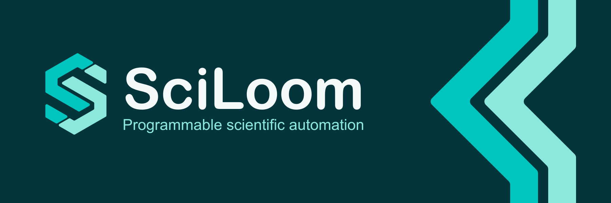

# Brand assets

SciLoom Identity 1.0 uses a woven S mark and two parallel folded bands. Straight
edges, small rounded corners and teal colors connect the icon to the banner.
The SVG originals have outlined lettering and require no installed fonts.

  
  

## Choose an asset

Use **light** assets on light backgrounds and **dark** assets on dark backgrounds.
Icons include their own square background; marks and horizontal lockups are
transparent. README and the handbook share these same assets.

| SVG original | Light | Dark |
|---|---|---|
| Square icon | [SVG](../assets/brand/svg/sciloom-icon-light.svg) | [SVG](../assets/brand/svg/sciloom-icon-dark.svg) |
| Transparent mark | [SVG](../assets/brand/svg/sciloom-mark-light.svg) | [SVG](../assets/brand/svg/sciloom-mark-dark.svg) |
| Monochrome mark | [SVG](../assets/brand/svg/sciloom-mark-mono-light.svg) | [SVG](../assets/brand/svg/sciloom-mark-mono-dark.svg) |
| Horizontal lockup | [SVG](../assets/brand/svg/sciloom-lockup-light.svg) | [SVG](../assets/brand/svg/sciloom-lockup-dark.svg) |
| Lockup with tagline | [SVG](../assets/brand/svg/sciloom-lockup-tagline-light.svg) | [SVG](../assets/brand/svg/sciloom-lockup-tagline-dark.svg) |
| Banner, 3:1 | [SVG](../assets/brand/svg/sciloom-banner-light.svg) | [SVG](../assets/brand/svg/sciloom-banner-dark.svg) |
| Social card | [SVG](../assets/brand/svg/sciloom-social-light.svg) | [SVG](../assets/brand/svg/sciloom-social-dark.svg) |

### PNG icons

| Size | Light | Dark |
|---|---|---|
| 16 px | [PNG](../assets/brand/icons/sciloom-icon-light-16.png) | [PNG](../assets/brand/icons/sciloom-icon-dark-16.png) |
| 24 px | [PNG](../assets/brand/icons/sciloom-icon-light-24.png) | [PNG](../assets/brand/icons/sciloom-icon-dark-24.png) |
| 32 px | [PNG](../assets/brand/icons/sciloom-icon-light-32.png) | [PNG](../assets/brand/icons/sciloom-icon-dark-32.png) |
| 48 px | [PNG](../assets/brand/icons/sciloom-icon-light-48.png) | [PNG](../assets/brand/icons/sciloom-icon-dark-48.png) |
| 64 px | [PNG](../assets/brand/icons/sciloom-icon-light-64.png) | [PNG](../assets/brand/icons/sciloom-icon-dark-64.png) |
| 128 px | [PNG](../assets/brand/icons/sciloom-icon-light-128.png) | [PNG](../assets/brand/icons/sciloom-icon-dark-128.png) |
| 180 px | [PNG](../assets/brand/icons/sciloom-icon-light-180.png) | [PNG](../assets/brand/icons/sciloom-icon-dark-180.png) |
| 192 px | [PNG](../assets/brand/icons/sciloom-icon-light-192.png) | [PNG](../assets/brand/icons/sciloom-icon-dark-192.png) |
| 256 px | [PNG](../assets/brand/icons/sciloom-icon-light-256.png) | [PNG](../assets/brand/icons/sciloom-icon-dark-256.png) |
| 512 px | [PNG](../assets/brand/icons/sciloom-icon-light-512.png) | [PNG](../assets/brand/icons/sciloom-icon-dark-512.png) |
| 1024 px | [PNG](../assets/brand/icons/sciloom-icon-light-1024.png) | [PNG](../assets/brand/icons/sciloom-icon-dark-1024.png) |

Transparent PNG marks are also available in 128, 256, 512 and 1024 px. The
[asset manifest](../assets/brand/manifest.json) lists every file, dimension and
color in the collection.

### Banners and sharing

| Size | Light | Dark |
|---|---|---|
| 1800 × 600 | [PNG](../assets/brand/banners/sciloom-banner-light-1800x600.png) | [PNG](../assets/brand/banners/sciloom-banner-dark-1800x600.png) |
| 1500 × 500 | [PNG](../assets/brand/banners/sciloom-banner-light-1500x500.png) | [PNG](../assets/brand/banners/sciloom-banner-dark-1500x500.png) |
| 1200 × 400 | [PNG](../assets/brand/banners/sciloom-banner-light-1200x400.png) | [PNG](../assets/brand/banners/sciloom-banner-dark-1200x400.png) |
| 900 × 300 | [PNG](../assets/brand/banners/sciloom-banner-light-900x300.png) | [PNG](../assets/brand/banners/sciloom-banner-dark-900x300.png) |
| 1200 × 630 social card | [PNG](../assets/brand/social/sciloom-social-light-1200x630.png) | [PNG](../assets/brand/social/sciloom-social-dark-1200x630.png) |

The [light animated banner](../assets/brand/motion/sciloom-banner-light-animated.svg)
and [dark animated banner](../assets/brand/motion/sciloom-banner-dark-animated.svg)
use a subtle ten-second color cycle. Their shapes stay fixed. They automatically
remain static when the viewer requests reduced motion. The handbook and README
use static banners.

### Browser and application icons

- [SVG favicon](../assets/brand/favicon.svg)
- [Multi-size ICO favicon](../assets/brand/favicon.ico), containing 16–256 px layers
- [Apple touch icon](../assets/brand/apple-touch-icon.png), 180 px
- [Web application manifest](../assets/brand/site.webmanifest), with 192 and 512 px icons

## Keep the identity consistent

Preserve the aspect ratio, band widths and small corner radii. Leave at least
one band width of space around a standalone mark. Prefer 24 px or larger for
icons; reserve 16 px for browser tabs. Use the monochrome mark when two colors
are unsuitable. Do not add outlines, shadows or extra colors.

The maintained assets live in `docs/site/assets/brand/`. Update the SVG originals
and their corresponding PNG, ICO and animated exports together. The brand
version identifies this asset set independently of the Python package version.
