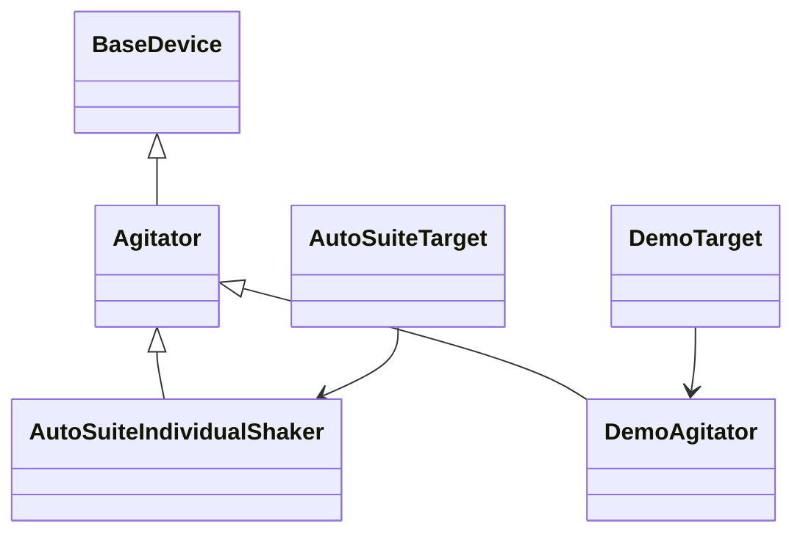

# Contributing a device or target

Device contracts define parameters and commands. Targets validate and emit platform
programs. Independent packages use the same public interfaces as sciloom.contrib;
no plugin registry or namespace installation is required.

## A minimal target

This complete target accepts a device-free program and emits a textual summary:

```python
from sciloom.core.compiler import Artifact, compile_ir
from sciloom.core.devices import DeviceBindings
from sciloom.core.diagnostics import Diagnostic
from sciloom.core.ir import FunctionIR, Program


class SummaryTarget:
    target_id = "example.summary/v1"

    def resolve_devices(self, program: Program) -> DeviceBindings:
        return DeviceBindings()

    def validate(self, program: Program) -> tuple[Diagnostic, ...]:
        return ()

    def emit(self, program: Program) -> Artifact:
        return Artifact(content=f"functions={len(program.functions)}\n".encode(),
                        media_type="text/plain", suffix=".txt")


program = Program(entry_function_id="empty", functions=(FunctionIR(node_id="empty", name="Empty"),))
assert compile_ir(program, target=SummaryTarget()).artifact.content == b"functions=1\n"
```

Returning empty bindings cannot satisfy a program with device resources. Device
targets should use their immutable deployment configuration to provide the complete
trusted binding envelope. Target validation returns diagnostics; emission returns
an Artifact, not an arbitrary string or a hardware connection.

## Device families and concrete profiles



BaseDevice imposes no universal start/stop methods. Agitator defines its family's
speed/configuration/lifecycle contract. Concrete profiles use immutable deployment
data and stable versioned device_type_id identifiers. Inheritance establishes type
relationships; writable_properties, required_configuration and supported_operations
explicitly declare capability and startup requirements.

Use a Python property with `@operation(id=...)` on its setter for configuration.
Setter and getter value types must match; the setter takes one typed value and
returns None. Registered parameters use assignment, not parallel set_* methods.
Commands also use operation with typed arguments and None return. The compiler
reads declarations without executing their bodies; host access is protected.

The [independent contribution example](../examples/demo-device.md) includes the
full DemoAgitator and DemoTarget implementation. It adds gain and a native calibrate
command without changing core. `bind_device` and `device_contract` from
sciloom.devices.declarations convert Python declarations to trusted data contracts.

Capabilities may use existing scalar/quantity/list types. Do not add arbitrary
Python objects or dynamic imports to JSON. Define actual target constraints with
evidence; a target may reject values whose range it cannot prove. A registered
native command is not automatically executable by the reference interpreter.
