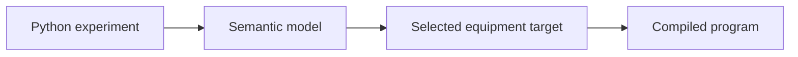

# SciLoom

**Programmable scientific automation from one semantic model.**

Describe an experiment using a restricted Python DSL. SciLoom checks its typed
semantic model and compiles it for an explicitly selected equipment target.
Experiment authors use Python classes, assignments and control flow; contributors
provide device contracts and target implementations.

The current implementation supports Function programs, scalar and list state,
physical rotational-speed values, device configuration and explicit start/stop.
AutoSuite is the first maintained target. Compilation does not operate equipment.

- [Current capabilities](introduction/status.md)
- [Author API reference](api/author.md)
- [Build and preview these docs](developer/documentation.md)

This is a development project. The public handbook is being assembled from the
implemented behavior; the source repository currently requires access.
