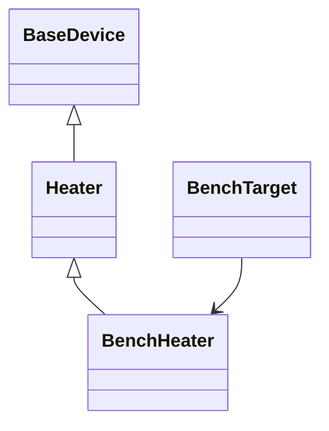

# Add a device

Two different jobs are both called "adding a device". Adding a **profile** describes
one concrete instrument in a family SciLoom already knows, the way DemoAgitator
describes a test shaker. Adding a **family** teaches SciLoom a kind of instrument it
has never seen, with its own parameters and commands.

This page builds a family, because it is the harder one and it contains the other.
Nothing here changes SciLoom: every declaration below can live in your own package.



## Step 1: declare the family

A family says what any instrument of this kind can be asked to do. It never says
which instrument, and it never touches hardware.

```python
class Heater(BaseDevice):
    """A device family: what every heater can be asked to do."""

    device_type_id: ClassVar[str] = "example.heater/v1"

    @property
    def setpoint(self) -> float:
        raise TypeError("Device property reads are not supported yet.")

    @setpoint.setter
    @operation(id="example.heater.setpoint/v1")
    def setpoint(self, value: float) -> None:
        """Save the target temperature to apply when heating starts."""

    @operation(id="example.heater.hold/v1")
    def hold(self, seconds: float) -> None:
        """Hold the saved setpoint for a duration."""
```

Four rules are doing work here.

The `device_type_id` is namespaced and versioned, and every device class needs its
own. It is the identity that reaches JSON, so it outlives your Python class.

A parameter is a property whose **setter** carries `@operation(id=...)`. Authors
then write `self.heater.setpoint = 60.0`, an assignment, rather than a `set_*`
method. The getter must exist so the types are declared in one place, and it raises,
because reading a device is not supported yet.

A command is a method carrying `@operation(id=...)` that returns `None` and takes
typed arguments. `float`, `int`, `bool`, physical quantities and homogeneous lists
of those are available; arbitrary Python objects are not, because the argument has
to survive serialization.

Bodies are never executed. The compiler reads signatures and type hints statically,
so a docstring is a complete implementation for a declaration.

## Step 2: declare a concrete profile

A profile is one deployable instrument. It is immutable data plus an explicit
promise about what it can actually do.

```python
@dataclass(frozen=True, kw_only=True)
class BenchHeater(Heater):
    """A concrete deployment of the heater family."""

    channel: str = "A"
    device_type_id: ClassVar[str] = "example.bench-heater/v1"
    writable_properties: ClassVar[tuple[str, ...]] = ("setpoint",)
    required_configuration: ClassVar[tuple[str, ...]] = ("setpoint",)
    supported_operations: ClassVar[tuple[Callable[..., None], ...]] = (Heater.hold,)
```

The three capability lists must be declared on the profile itself. Inheriting them
is rejected, deliberately: a profile promises what its hardware does, and a promise
inherited by accident is not a promise. A heater that cannot be set, only read back,
declares an empty `writable_properties` and a program that writes to it fails to
compile rather than failing on the bench.

Use `ClassVar` for all three. Without it a frozen dataclass would turn them into
instance fields.

## Step 3: write a Function against the family

An experiment names the family, never the profile.

```python
class Anneal(Function):
    heater: Heater
    temperature: Input[float]
    done: Output[bool]

    @runtime
    def run(self) -> None:
        self.heater.setpoint = self.temperature
        self.heater.hold(30.0)
        self.done = True
```

`heater: Heater` declares a device slot, not a runtime variable. The slot is how
the same program survives being deployed onto a different heater later.

## Step 4: bind the profile in a target

The author never names hardware; deployment does. A target turns your profile into
the trusted facts the compiler checks against.

```python
    def resolve_devices(self, program: Program) -> DeviceBindings:
        return DeviceBindings(
            devices=tuple(
                bind_device(logical_id=name, device=device, physical_id=f"bench:{device.channel}")
                for name, device in self.devices.items()
            )
        )
```

`bind_device` reads the profile's declarations and capability lists and returns a
`DeviceBinding`: the logical name the program used, the physical identity you chose,
the profile's contract, and every ancestor contract. The complete target is at the
end of this page, and [add a target](add-a-target.md) builds one step by step.

## Step 5: compile and read back what you declared

```text
target: example.bench/v1
nodes: ConfigureProperty, DeviceCommand, Assignment
resources: ['heater']
contracts: ['sciloom.device/v1', 'example.heater/v1']
```

Three things are worth noticing in that output.

The property write became `ConfigureProperty` and the command became a generic
`DeviceCommand`. Only agitation has dedicated lifecycle nodes today; every other
family speaks through those two.

The recorded contracts are the **family's**, not the profile's. The program was
written against `Heater`, so its JSON can be rebound to any heater profile without
recompiling from Python. That is the same mechanism the
[portable agitation example](../examples/portable-agitation.md) demonstrates.

## Limits worth knowing before you ship

Reference execution rejects your native command. The last lines of the complete
example below print its refusal:

```text
interpreter: unsupported_operation Cannot execute DeviceCommand.
```

That is by design. The interpreter defines SciLoom semantics, and it will not
invent behavior for a command only your hardware understands. Compilation and
target emission still work; only simulated execution stops.

`required_configuration` is checked when an agitation lifecycle starts, and
agitation is the only family with such a node today. Your heater can declare it,
and a target can enforce it in `validate`, but nothing checks it for you yet.

Adding a profile to an existing family is Step 2 alone. The
[independent device example](../examples/demo-device.md) is exactly that: DemoAgitator
adds one parameter and one native command to the shipped Agitator family, with no
change to SciLoom.

## The complete example

```python
from collections.abc import Mapping
from dataclasses import dataclass
from types import MappingProxyType
from typing import Callable, ClassVar

from sciloom import Function, Input, Output, runtime
from sciloom.core.compiler import Artifact
from sciloom.core.bindings import DeviceBindings
from sciloom.core.diagnostics import Diagnostic, ExecutionError
from sciloom.core.interpreter import Interpreter
from sciloom.core.ir import Program, to_json
from sciloom.devices import BaseDevice, operation
from sciloom.devices.declarations import bind_device


class Heater(BaseDevice):
    """A device family: what every heater can be asked to do."""

    device_type_id: ClassVar[str] = "example.heater/v1"

    @property
    def setpoint(self) -> float:
        raise TypeError("Device property reads are not supported yet.")

    @setpoint.setter
    @operation(id="example.heater.setpoint/v1")
    def setpoint(self, value: float) -> None:
        """Save the target temperature to apply when heating starts."""

    @operation(id="example.heater.hold/v1")
    def hold(self, seconds: float) -> None:
        """Hold the saved setpoint for a duration."""


@dataclass(frozen=True, kw_only=True)
class BenchHeater(Heater):
    """A concrete deployment of the heater family."""

    channel: str = "A"
    device_type_id: ClassVar[str] = "example.bench-heater/v1"
    writable_properties: ClassVar[tuple[str, ...]] = ("setpoint",)
    required_configuration: ClassVar[tuple[str, ...]] = ("setpoint",)
    supported_operations: ClassVar[tuple[Callable[..., None], ...]] = (Heater.hold,)


class Anneal(Function):
    """Hold a caller-selected temperature on any bound heater.

    Attributes:
        heater: Logical heater bound by the selected target.
        temperature: Target temperature supplied by the caller.
        done: Set once the hold has been requested.
    """

    heater: Heater
    temperature: Input[float]
    done: Output[bool]

    @runtime
    def run(self) -> None:
        self.heater.setpoint = self.temperature
        self.heater.hold(30.0)
        self.done = True


class BenchTarget:
    """Record the selected program as JSON for one bench heater."""

    target_id = "example.bench/v1"

    def __init__(self, *, devices: Mapping[str, BenchHeater]) -> None:
        self.devices = MappingProxyType(dict(devices))

    def resolve_devices(self, program: Program) -> DeviceBindings:
        return DeviceBindings(
            devices=tuple(
                bind_device(logical_id=name, device=device, physical_id=f"bench:{device.channel}")
                for name, device in self.devices.items()
            )
        )

    def validate(self, program: Program) -> tuple[Diagnostic, ...]:
        return ()

    def emit(self, program: Program) -> Artifact:
        return Artifact(content=to_json(program).encode("utf-8"), media_type="application/json", suffix=".json")


result = Anneal().compile(target=BenchTarget(devices={"heater": BenchHeater(channel="A")}))
print("target:", result.target_id)
print("nodes:", ", ".join(type(node).__name__ for node in result.semantic_ir.functions[0].body))
print("resources:", [resource.logical_id for resource in result.semantic_ir.resources])
print("contracts:", [contract.type_id for contract in result.semantic_ir.device_types])

assert result.target_id == "example.bench/v1"
assert [type(node).__name__ for node in result.semantic_ir.functions[0].body] == [
    "ConfigureProperty",
    "DeviceCommand",
    "Assignment",
]
assert [resource.logical_id for resource in result.semantic_ir.resources] == ["heater"]
assert [contract.type_id for contract in result.semantic_ir.device_types] == [
    "sciloom.device/v1",
    "example.heater/v1",
]

try:
    Interpreter(result.specialized_ir).run(inputs={"temperature": 60.0})
    raise AssertionError("reference execution should refuse an undefined native command")
except ExecutionError as error:
    assert error.diagnostics[0].code == "unsupported_operation"
    print("interpreter:", error.diagnostics[0].code, error.diagnostics[0].message)
```
