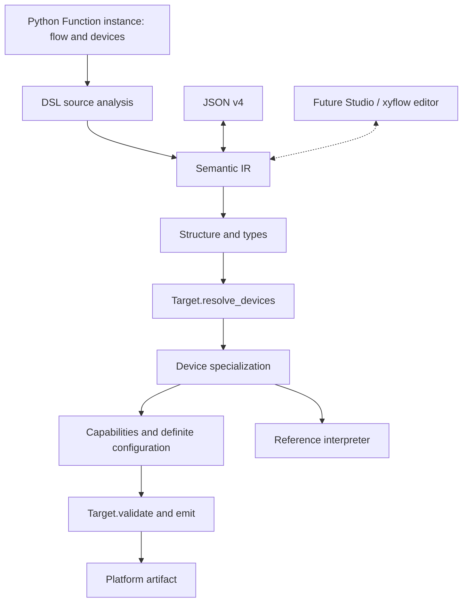

# Architecture and ownership

The typed semantic Program is the source of execution meaning. Python is the
authoring DSL; targets own platform-specific validation and serialization.

| Package | Responsibility |
|---|---|
| sciloom | Lazy experiment-author imports |
| sciloom.flow | Procedure and control vocabulary: Function, runtime fields, device slots, compile-time queries |
| sciloom.devices | Controlled things: device families, member declarations, contracts and bindings |
| sciloom.dsl | DSL source analysis: one Python Function instance to validated IR |
| sciloom.units | Independent physical quantities |
| sciloom.core.ir | Typed nodes/types, validation and JSON |
| sciloom.core.compiler | Target protocol, pipeline and artifacts |
| sciloom.core.bindings / specialization | Data-only binding facts and branch selection |
| sciloom.core.configuration | Capability checks and definite device configuration |
| sciloom.core.interpreter | Reference execution sessions |
| sciloom.core.diagnostics | Errors, diagnostics and source spans |
| sciloom_autosuite | AutoSuite device profiles, legality and XML generation; the workspace member `sciloom-autosuite` under `packages/` |

`flow` and `devices` are the two vocabularies an author writes; `dsl` is the only
layer that reads Python source; `core` imports neither. Dependencies run dsl to
flow to devices to core, with one deliberate exception: `Function.to_ir` defers an
import of the analysis driver, because the author-facing type owns the entry point
while the analysis needs that type at runtime. An equipment target declares and
binds devices, so it may import `sciloom.devices`; no target imports the flow
vocabulary or the source analysis. Independent equipment packages implement the
same Target protocol without joining the SciLoom source tree or registering a
plugin; the shipped AutoSuite target is itself a separate workspace member with
its own distribution. Unit types remain independent.

Two device abstractions meet in that pipeline and are kept apart on purpose. The
author side is a chain of Python classes in `sciloom.devices`: `BaseDevice`, a
generic family such as `Agitator`, and an author's own subclass of that family
adding the properties and operations their instrument needs, the way
`DemoAgitator` adds `gain` and `calibrate`. Authors extend by subclassing the
family and never modify `BaseDevice` or the family itself; a capability the
family lacks belongs in a subclass, as [Add a device](add-a-device.md) shows. The
target side is the concrete profile that a target binds to each slot at compile
time. The IR expresses property writes as `ConfigureProperty` and every operation that
has no dedicated node as `DeviceCommand`, each carrying the semantic id from the
author's class (today only agitation start/stop have dedicated nodes), and the
compiler decides only whether the current IR compiles for the selected target;
neither layer knows nor special-cases any author subclass.

Within the analysis, shared state, source discovery, expression conversion and
statement conversion have separate responsibilities, and every statement recursion
lives in one module. A function that needs lowering state takes the context first,
named context. A recognizer returns None for a shape it does not own, and once it
has matched it reports through context.fail rather than returning None, because
the statement pass reads None as "try the next recognizer"; recognizer order is
therefore meaningful. Names used only inside their module are underscore-prefixed,
and the one function-local import in the frontend carries a comment naming the
cycle it breaks. IR structure checking, expression typing, program validation and
JSON conversion are distinct.
The interpreter separates values, expression evaluation and session/device state.
AutoSuite code generation retains a thin serialization model below semantic IR.

## Future editing tools

Studio will compose semantic IR directly. Function schemas can describe node ports
and docstrings can describe their purpose. Layout stays outside semantic state.
The GUI, node catalogue, server and docstring extraction service are not implemented.
AI-authored Python remains subject to the same schema, source and target validation.
