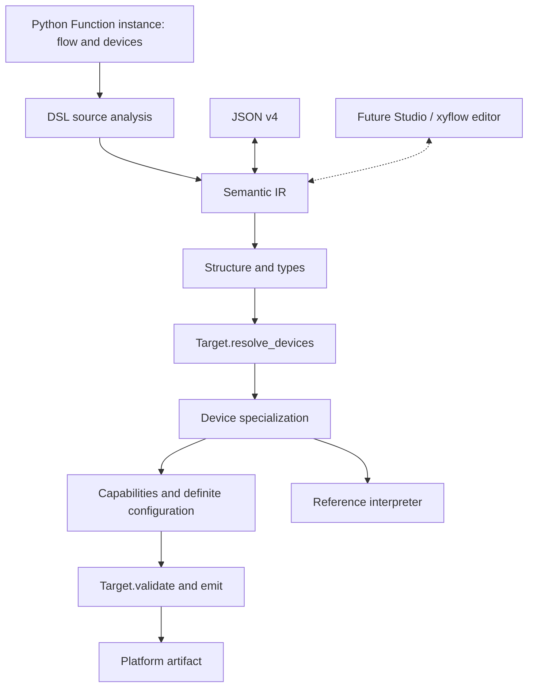

# Compilation pipeline

`Function.compile(target=...)` converts the instance to IR and hands it to the
shared compiler; `compile_ir(program, target=...)` accepts directly constructed
or JSON-loaded IR. The pipeline is fixed and target-independent until its last
two steps.

## Steps

| Step | Function | Program it sees | Raises or returns |
|---|---|---|---|
| 1 | `validate(program)` | authored | `IRValidationError` |
| 2 | `target.resolve_devices(program)` | authored: the only step that sees device branches unselected | the target's own `TypeError` or `ValueError`; `TypeError` when the result is not `DeviceBindings` |
| 3 | `specialize(program, bindings)` | authored in, selected out: bindings validated, branches selected, unreachable functions pruned, resources retyped to the bound profile, re-validated | `CompilationError` (`missing_resource_binding`, `unknown_resource_binding`, `device_type`, `device_contract`) |
| 4 | capability and definite-configuration checks | selected | `CompilationError` (`device_capability`, `device_configuration`) |
| 5 | `target.validate(program)` | selected | `CompilationError` with the target's own codes |
| 6 | `target.emit(program)` | selected | returns an `Artifact` |

Target resolution sees the authored program once; validation and emission see
the selected program. What step 4 proves about required configuration is stated
on [device contracts](device-contracts.md#required-configuration).

`CompileResult` retains `semantic_ir` (authored), `specialized_ir` (selected),
`target_id`, `artifact` and `diagnostics`, which is empty for a returned result
because every failure raises. `write(path)` writes the artifact's bytes and
returns the path. Backend-private variables and parameters never enter either
public program. Bindings are described on the [Target contract](target-contract.md#bindings)
and the selection step on [specialization internals](../advanced/specialization.md).

## Who can say no

Every layer answers at the earliest point that can prove a program wrong, and
each only knows what it can see: the class body has no target, and the target has
no Python source.

| When | What it proves | Raises |
|---|---|---|
| the class body runs | declarations are well formed: field roles, device slots, device contracts | `IRValidationError` |
| `to_ir()` | the runtime method is in the supported source subset and types agree | `IRValidationError` |
| `compile_ir` starts | the IR is structurally valid, whatever produced it | `IRValidationError` |
| `resolve_devices` | the deployment data is the kind the target supports; each profile declares its capability lists | the target's own `TypeError` or `ValueError`; `bind_device`'s `TypeError` |
| bindings are checked | every declared resource has one compatible binding and no binding is stray | `CompilationError` |
| capabilities and configuration are checked | every bound profile implements what the selected program does with it, and every agitation start has its [required configuration](device-contracts.md#required-configuration) | `CompilationError` |
| `Target.validate` | the program fits the platform | `CompilationError` |
| reference execution | the program has defined semantics to simulate | `ExecutionError` |

The walkthrough [reject a program](../tutorial/reject-a-program.md) shows five of
these layers on one program and explains where a contributor's own check belongs.
How the shipped target lowers device intent is on
[native commands](../advanced/native-commands.md).
