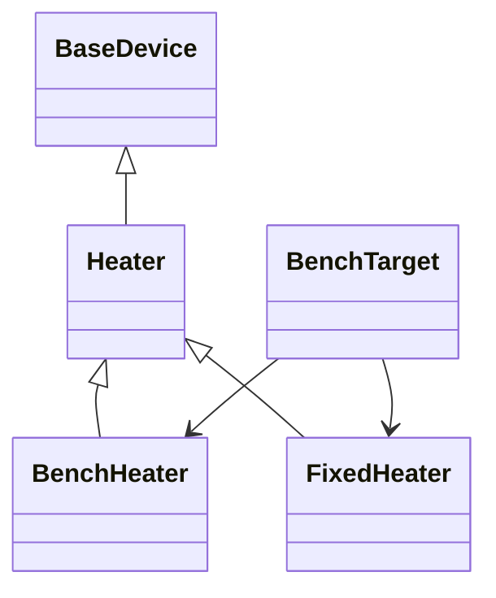

# The heater story

Two different jobs are both called "adding a device". Adding a **profile**
describes one concrete instrument in a family SciLoom already knows, the way
`DemoAgitator` in the [independent device example](../../examples/demo-device.md)
describes a test shaker; that job is [step 2](declare-profiles.md) of this series
on its own. Adding a **family** teaches SciLoom a kind of instrument it has never
seen, with its own parameters and commands; that job is the whole series.

The series builds a heater family, two profiles for it, a Function that uses the
family, a target that binds a profile and refuses what its bench cannot prove,
the rejections a contributor meets, a program that adapts to the bound
instrument, and finally what the reference interpreter can and cannot run.
Nothing in it changes SciLoom: every declaration lives in your own package.

| Page | You add | You learn |
|---|---|---|
| [1. Declare a family](declare-a-family.md) | `Heater` | identity, a property, a command, what a contract records |
| [2. Declare profiles](declare-profiles.md) | `BenchHeater`, `FixedHeater` | deployment data, the three capability lists, why they are never inherited |
| [3. Write a Function against the family](write-a-function.md) | `Anneal` | the authored program names the family, not the profile |
| [4. Write a target](write-a-target.md) | `BenchTarget` | the four members; deployment checks; `resolve_devices`, `validate`, `emit` |
| [5. Reject a program](reject-a-program.md) | `RuntimeHold` and four rejections | which layer speaks, reading a diagnostic, where your check belongs |
| [6. Adapt with comptime](adapt-with-comptime.md) | `Adaptive` | adapting instead of rejecting |
| [7. Execute what you can](execute-what-you-can.md) | `Preheat` | reference execution's limit for native commands |
| [8. The complete program](complete-program.md) | | the seven steps as one file |

Each page adds one block to one file; paste them in order and run the file
after each page. The output shown under every step was produced by running the
program built so far, and the documentation tests re-run every step on every
change. Page 1 imports everything the series uses, so that each later block is
only the new declarations.

--8<-- "website/snippets/hardware-boundary.md"
