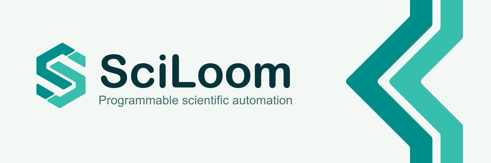
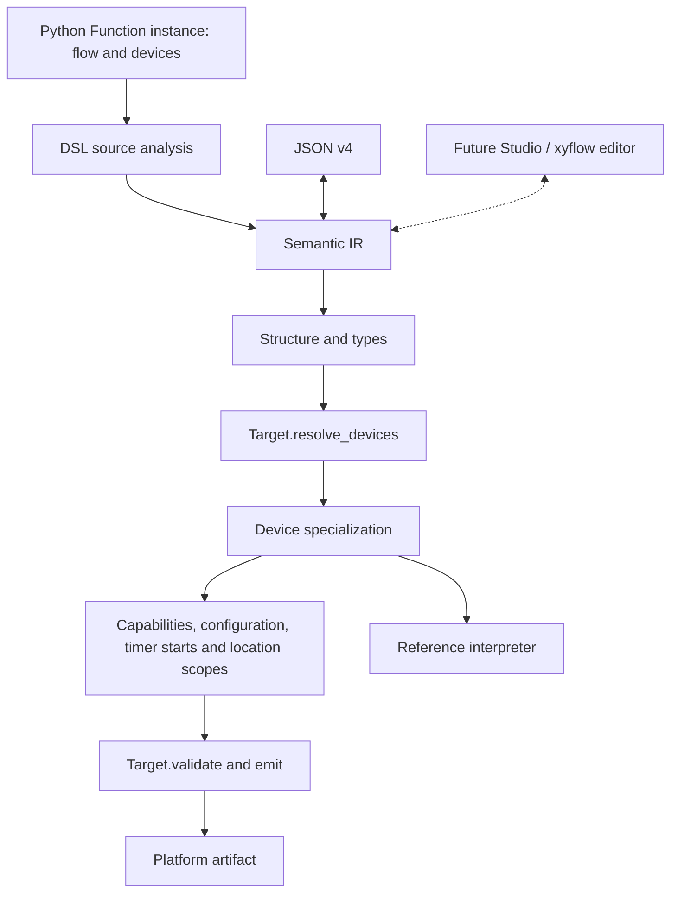

# SciLoom

  
  

**Programmable scientific automation from one semantic model.**

Describe an experiment using a restricted Python DSL. SciLoom checks its typed
semantic model and compiles it for an explicitly selected equipment target.
Experiment authors use Python classes, assignments and control flow; contributors
provide device contracts and target implementations.

## How it fits together

**The author writes a Function.** A Function is a Python class: its body declares
inputs, outputs, persistent state and *logical* devices such as `shaker: Agitator`,
and one `@runtime` method holds the procedure. The class body and `__init__`
run as ordinary Python, configuring and composing instances; the runtime method
is the one part that is never executed on the author's computer, only read. The [tutorial](user-guide/tutorial/index.md)
builds one from scratch.

**Source analysis produces the semantic IR.** SciLoom reads the runtime method's
source and accepts a deliberate [subset of Python](user-guide/reference/runtime-language.md): assignments, `if`, `while`,
calls to child Functions, device property writes and lifecycle commands, and
compile-time queries about the bound device. Everything else is refused with a
diagnostic that names the statement. The result is a typed, target-independent
program that names device *families*, never a specific instrument;
[extending the analysis](developer/advanced/extending-the-analysis.md) describes
how the recognizers are organised.

**[JSON v4](developer/advanced/json-interchange.md) is the interchange form.**
The IR round-trips to JSON without loss, so
a program can be stored, inspected by tools, or handed to a different target
later. Nothing in the JSON refers to Python code; identifiers are semantic ids,
and no implementation is ever imported from one.

**The [compiler](developer/reference/pipeline.md) is fixed until the last two
steps.** It validates structure and types, asks the target which concrete device stands behind each logical slot
(`resolve_devices`), specializes the program to that deployment by selecting
device-dependent branches, then proves that every bound device supports what the
program does with it and that every agitation start has its configuration on
every path. It also proves each elapsed wait has a timer start in the current
entry invocation. Only then does the target validate and emit.

**The [target](developer/reference/target-contract.md) owns the platform.** A
target is four members, not a plugin:
`target_id`, `resolve_devices`, `validate` and `emit`. `validate` rejects what
the platform cannot do and can prove; `emit` returns bytes, a media type and a
suffix. AutoSuite is the first maintained target, shipped as the separate
`sciloom-autosuite` package, and an independent package implements the same
contract. The [developer guide](developer/index.md) shows how.

**The [reference interpreter](developer/reference/interpreter.md) defines
meaning, not hardware.** It runs a
specialized program to state what SciLoom semantics are: state, copying, device
configuration and lifecycle. It does not simulate an instrument, it refuses
native commands it cannot give meaning to, and it proves nothing about the
platform. Compilation does not operate equipment either;
[what compilation establishes](introduction/status.md#what-compilation-establishes)
draws the line.

**Devices come in two kinds, on purpose.** On the author side, `BaseDevice`, a
generic family such as `Agitator`, and an author's own subclass that adds the
properties and commands their instrument needs. On the target side, a *profile*
carrying deployment data, bound to a slot at compile time. Neither the IR nor
the compiler special-cases either; the
[architecture reference](developer/reference/architecture.md) states the rule.

## Where to go

The current implementation supports Function programs, scalar and list state,
text, physical volume/time/speed values, device configuration and explicit start/stop.

- [Get started](introduction/getting-started.md)
- [User guide](user-guide/index.md)
- [Developer guide](developer/index.md)
- [Example walkthroughs](examples/index.md)
- [Author API reference](api/author.md)
- [Glossary](introduction/glossary.md)

This is a development project. The handbook describes implemented behavior;
[future capabilities](introduction/status.md) are identified separately. The
source repository currently requires access.
