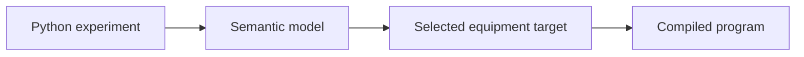

# SciLoom

  
  

**Programmable scientific automation from one semantic model.**

Describe an experiment using a restricted Python DSL. SciLoom checks its typed
semantic model and compiles it for an explicitly selected equipment target.
Experiment authors use Python classes, assignments and control flow; contributors
provide device contracts and target implementations.

The current implementation supports Function programs, scalar and list state,
physical rotational-speed values, device configuration and explicit start/stop.
AutoSuite is the first maintained target, shipped as the `sciloom-autosuite`
package. Compilation does not operate equipment.

- [Get started](introduction/getting-started.md)
- [User guide](user-guide/index.md)
- [Developer guide](developer/index.md)
- [Example walkthroughs](examples/index.md)
- [Author API reference](api/author.md)

This is a development project. The handbook describes implemented behavior;
[future capabilities](introduction/status.md) are identified separately. The
source repository currently requires access.
